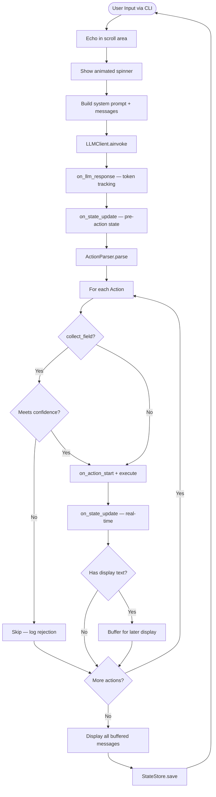

# Action-Based Conversational Agent

## Overview

A configurable conversational agent where the LLM returns structured JSON with actions that the runtime executes sequentially. The agent collects user information through natural conversation, manages state, and escalates when appropriate. All behavior is configuration-driven through a single JSON file.

## Architecture

- **Action-Driven Flow**: LLM returns `{"actions": [...]}`, runtime executes sequentially
- **Single JSON Configuration**: One config file defines all behavior (fields, personality, prompt, escalation)
- **Structured Output**: OpenRouter API with `response_format` JSON schema enforcement
- **State-in-Request**: Complete state sent with each LLM call for context
- **Dual State Store**: `MemoryStateStore` (tests) + `FileStateStore` (production, JSON files)
- **Protocol-Based**: `StateStore`, `OutputHandler`, `LLMClient` — all swappable via Protocol

## Conversation Flow



## Project Structure

```
src/agent/
├── __main__.py              — Entry point (--config, --test, --debug, --session, --session-dir)
├── config/loader.py         — Pydantic Config model + Config.load()
├── cli/app.py               — CLI with terminal layout, spinner, status bar
├── llm/
│   ├── client.py            — LLMClient Protocol
│   ├── openrouter.py        — OpenRouterClient (httpx async)
│   └── prompt_builder.py    — System prompt interpolation with config + state
├── models/
│   ├── actions.py           — Action classes (SendMessage, CollectField, UpdateState, Escalate)
│   └── state.py             — ConversationState, Message, FieldData, StepInfo
├── runtime/
│   ├── parser.py            — ActionParser (dict → Action instances)
│   ├── protocols.py         — OutputHandler Protocol
│   └── runtime.py           — Runtime orchestrator + RESPONSE_FORMAT schema
└── state/
    ├── file_store.py        — FileStateStore (JSON files per session)
    └── store.py             — StateStore Protocol + MemoryStateStore
```

## Key Design Decisions

### Actions execute on state, return `str | None`
Only `SendMessageAction` returns displayable text. `CollectFieldAction`, `UpdateStateAction`, `EscalateAction` return `None` — they silently mutate state.

### Display messages buffered until all actions complete
All `executing:` logs print as actions run, but agent messages display only after all actions finish. This prevents interleaved output (e.g., `send_message` display appearing before `update_state` log).

### Confidence threshold enforcement at runtime
Defense-in-depth: the system prompt tells the LLM not to collect low-confidence data, but the runtime also rejects `collect_field` actions below `field.confidence_threshold` from config.

### LLM manages steps via `update_state`
Steps are high-level (`greeting`, `collecting_fields`, `escalation`). The LLM infers step transitions from context and calls `update_state` to reflect them. Runtime does not initialize or manage steps.

### Real-time status bar updates
`on_state_update()` is called after **each** action executes (not just once per turn), so the status bar reflects field collection immediately.

### System prompt in markdown
The template in `system_prompt.template` uses markdown (headings, bold, tables) for better LLM comprehension.

### `send_message` must be last action
The system prompt enforces that every LLM response includes `send_message` as the last action, ensuring the user always gets a conversational reply.

### `EscalateAction` returns `None`
The LLM sends a warm goodbye via `send_message` before the `escalate` action. `EscalateAction` only updates state (`escalated=True`, `escalation_reason`).

## Terminal Layout

```
Row 1..(N-3)  — Scroll area: chat history, action logs, debug panels
Row N-2       — Rule separator ──────────────────────────
Row N-1       — Input: > (or > ⠹ Thinking... during processing)
Row N         — Status: session | step | name ✓ | email … | tokens: 1,625
```

- Scroll region set via ANSI escape `\033[1;{N-3}r`
- Status bar rendered on row N via cursor positioning (save/restore)
- Animated braille spinner runs as `asyncio.create_task` during LLM calls
- Graceful fallback in non-TTY mode (tests)

## Configuration

All behavior driven by a single JSON file passed via `--config`:

```json
{
  "agent":        { "name", "greeting", "model", "temperature", "max_tokens" },
  "personality":  { "tone", "style", "formality", "emoji_usage", "prompt" },
  "collection":   { "max_attempts", "escalate_on_max_attempts" },
  "fields":       [{ "name", "type", "required", "description", "validation", "confidence_threshold" }],
  "actions":      { "available": [{ "type", "description", "parameters" }] },
  "escalation":   { "enabled", "policies": [{ "enabled", "reason", "description" }] },
  "system_prompt": { "template", "dynamic_sections" }
}
```

Multiple configs available: `example_config.json`, `clinic_appointments_config.json`, `pizza_place_config.json`, `travel_agency_config.json`.

## Commands

```bash
pip install -e ".[dev]"                                          # install
pytest -v                                                        # 53 tests
python -m agent --config configs/example_config.json             # run
python -m agent --config configs/example_config.json --debug     # debug mode
python -m agent --config configs/example_config.json --test      # test LLM (no API)
python -m agent --config configs/example_config.json --session <id>  # resume session
```

## Commit History

| # | Description | Status |
|---|-------------|--------|
| 1 | Project setup, core models, config loader, schemas | Done |
| 2 | StateStore, OutputHandler, ActionParser, PromptBuilder | Done |
| 3 | Runtime orchestrator | Done |
| 4 | CLI interface with test mode | Done |
| 5 | OpenRouter LLM client + system prompt engineering + debug mode | Done |
| 6 | FileStateStore + enhanced CLI (status bar, spinner, terminal layout) | Done |
| 7 | Documentation | Planned |
