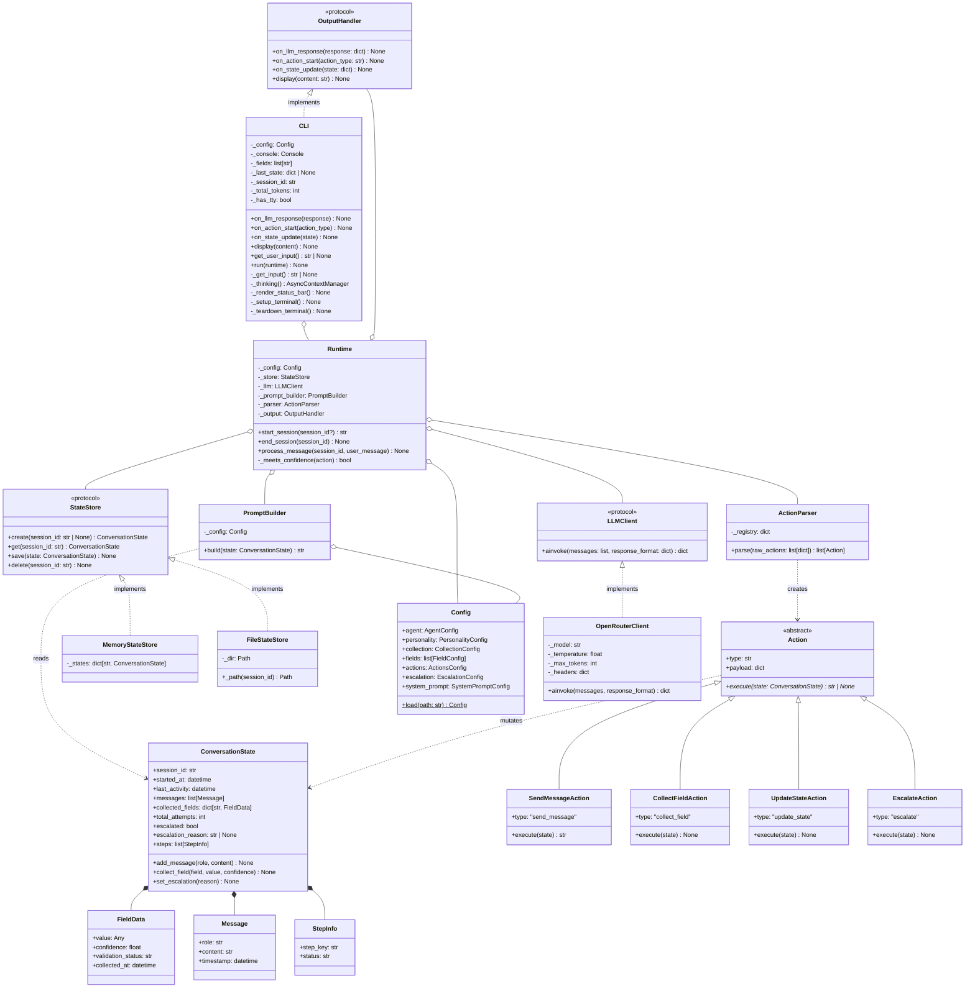

# Class Diagram

## System Architecture Overview



## Key Design Patterns

### 1. Command Pattern
- `Action` classes encapsulate operations as objects
- Each Action self-executes via `execute(state) -> str | None`
- Runtime iterates actions without knowing their implementation
- Only `SendMessageAction` returns displayable text; others return `None`

### 2. Repository Pattern
- `StateStore` Protocol provides CRUD-only data access
- `MemoryStateStore` — in-memory dict (tests)
- `FileStateStore` — JSON files on disk (production)

### 3. Strategy Pattern
- `LLMClient` Protocol allows swapping implementations (OpenRouter, test mode)
- `OpenRouterClient` uses httpx async with structured JSON output

### 4. Observer Pattern
- `OutputHandler` Protocol decouples Runtime from CLI
- CLI receives real-time callbacks: `on_llm_response`, `on_state_update`, `on_action_start`, `display`
- `on_state_update` called after each action for real-time status bar updates

## Data Flow

1. **User Input** → CLI `_get_input()` → fixed input row (N-1)
2. **CLI** echoes message in scroll area → starts spinner → calls `runtime.process_message()`
3. **Runtime** → saves user message → builds prompt via `PromptBuilder` → calls `LLMClient.ainvoke()`
4. **Runtime** → notifies `on_llm_response()` (tokens update) → `on_state_update()` (pre-action state)
5. **Runtime** → parses actions → for each: `on_action_start()` → `execute(state)` → `on_state_update()` (real-time)
6. **Runtime** → collects display results → `display()` all messages after all actions complete
7. **Runtime** → persists state via `StateStore.save()`

## Terminal Layout (TTY mode)

```
Row 1..(N-3)  — Scroll area: chat messages, action logs, debug panels
Row N-2       — Rule separator (dim line)
Row N-1       — Input prompt: > (or > ⠹ Thinking... during processing)
Row N         — Status bar: session | step | fields | tokens
```
