# Class Diagram — Antartia

## System Architecture

```mermaid
classDiagram
    %% ── Protocols ─────────────────────────────────────────────────────────────

    class LLMClient {
        <<protocol>>
        +ainvoke(messages: list, response_format: dict) dict
    }

    class StateStore {
        <<protocol>>
        +create(session_id: str | None) ConversationState
        +get(session_id: str) ConversationState
        +save(state: ConversationState) None
        +delete(session_id: str) None
    }

    class OutputHandler {
        <<protocol>>
        +on_llm_start(depth: int) None
        +on_llm_response(response: dict) None
        +on_vision_start(filename: str) None
        +on_system_prompt(prompt: str) None
        +on_action_start(action_type: str) None
        +on_state_update(state: dict) None
        +on_task_progress(message: str) None
        +display(content: str) None
    }

    %% ── State ─────────────────────────────────────────────────────────────────

    class ConversationState {
        +session_id: str
        +started_at: datetime
        +last_activity: datetime
        +messages: list[Message]
        +add_message(role, content) None
    }

    class Message {
        +role: str
        +content: str
        +timestamp: datetime
    }

    %% ── Actions ───────────────────────────────────────────────────────────────

    class Action {
        <<abstract>>
        +type: str
        +payload: dict
        +execute(state: ConversationState)* str | None
    }

    class SendMessageAction {
        +type: "send_message"
        +execute(state) str
    }

    class FinishAction {
        +type: "finish"
        +execute(state) None
    }

    class ToolAction {
        <<abstract>>
        +execute(state) None
    }

    class GetLatestLocationsAction { +type: "get_latest_locations" }
    class GetLocationsByDateAction { +type: "get_locations_by_date" }
    class GetPhotosAction { +type: "get_photos" }
    class GetWeatherAction { +type: "get_weather" }
    class CreateTaskAction { +type: "create_task" }
    class ScanPhotoInboxAction { +type: "scan_photo_inbox" }
    class SearchKnowledgeAction { +type: "search_knowledge" }
    class IndexKnowledgeAction { +type: "index_knowledge" }
    class PublishDailyProgressAction { +type: "publish_daily_progress" }
    class PublishRouteSnapshotAction { +type: "publish_route_snapshot" }
    class UploadImageAction { +type: "upload_image" }
    class PublishAgentMessageAction { +type: "publish_agent_message" }
    class PublishWeatherSnapshotAction { +type: "publish_weather_snapshot" }

    %% ── Config ────────────────────────────────────────────────────────────────

    class Config {
        +agent: AgentConfig
        +personality: PersonalityConfig
        +actions: ActionsConfig
        +system_prompt: SystemPromptConfig
        +runtime: RuntimeConfig
        +http_server: HttpServerConfig
        +scheduler: SchedulerConfig
        +db: DbConfig
        +photo_pipeline: PhotoPipelineConfig
        +image_preprocessing: ImagePreprocessingConfig
        +weather: WeatherConfig
        +knowledge: KnowledgeConfig
        +remote_sync: RemoteSyncConfig
        +load(path)$ Config
    }

    %% ── Runtime ───────────────────────────────────────────────────────────────

    class Runtime {
        -_config: Config
        -_store: StateStore
        -_llm: LLMClient
        -_output: OutputHandler
        -_db: Database
        +start_session(session_id?) str
        +process_message(session_id, user_message) None
        -_dispatch_tool(action_type, payload) str
    }

    class Scheduler {
        -_config: Config
        -_db: Database
        -_semaphore: ExecutionSemaphore
        -_task_runner: TaskRunner
        +run() None
        -_tick() None
        -_generate_due_tasks(repo) None
    }

    class ExecutionSemaphore {
        -_lock: asyncio.Lock
        -_state: SemaphoreState
        +is_idle: bool
        +acquire_typing() None
        +acquire_llm() None
        +acquire_task() None
        +release() None
    }

    class TaskRunner {
        -_config: Config
        -_db: Database
        -_output: OutputHandler
        +execute(task: dict) None
    }

    class ActionParser {
        +parse(raw_actions: list[dict]) list[Action]
    }

    %% ── LLM Clients ───────────────────────────────────────────────────────────

    class OllamaClient {
        -_model: str
        -_base_url: str
        +ainvoke(messages, response_format) dict
    }

    class OllamaVisionClient {
        -_model: str
        -_base_url: str
        -_prompt: str
        +describe(image_path) VisionResult
    }

    class OpenRouterClient {
        -_model: str
        -_headers: dict
        +ainvoke(messages, response_format) dict
    }

    class VisionResult {
        +description: str
        +summary: str
    }

    %% ── Database ──────────────────────────────────────────────────────────────

    class Database {
        -_path: Path
        -_conn: aiosqlite.Connection
        +init_all_tables() None
        +connect() None
        +close() None
    }

    class LocationsRepository {
        +insert(lat, lon, recorded_at) dict
        +get_latest(limit) list[dict]
        +get_by_date(date) list[dict]
        +get_all() list[dict]
    }

    class PhotosRepository {
        +insert(file_path, file_name, folder) dict
        +get_by_id(id) dict
        +get_by_path(path) dict
        +get_all(vision_status?, is_remote_candidate?, date?) list[dict]
        +update(photo_id, **fields) None
        +count_uploaded_today() int
    }

    class WeatherRepository {
        +insert(...) dict
        +get_latest() dict
        +get_today() list[dict]
    }

    class TasksRepository {
        +insert(type, payload) dict
        +claim_next() dict | None
        +complete(task_id) None
        +fail(task_id, error) None
        +count_pending() int
    }

    class MessagesRepository {
        +insert(session_id, role, content) dict
        +get_today(session_id?) list[dict]
        +mark_published(message_id) None
    }

    %% ── Services ──────────────────────────────────────────────────────────────

    class PhotoService {
        -_preprocessor: ImagePreprocessingService
        -_vision: OllamaVisionClient
        -_threshold: float
        +scan_inbox() int
        +process_photo(photo_id) None
        -_score_significance(description) float
    }

    class ImagePreprocessingService {
        -_cfg: ImagePreprocessingConfig
        -_preview_dir: Path
        +process(source_path) PreprocessResult
    }

    class WeatherService {
        -_config: Config
        -_db: Database
        +fetch_and_store(lat?, lon?) dict
    }

    class KnowledgeService {
        -_config: KnowledgeConfig
        -_ollama_url: str
        +index_documents() int
        +search(query, n_results?) str
        -_embed(texts) list[list[float]]
        -_chunk(text) list[str]
    }

    class PreprocessResult {
        +source_path: Path
        +preview_path: Path
        +original_width: int
        +original_height: int
        +preview_width: int
        +preview_height: int
        +sha256: str
    }

    %% ── State Store Implementations ───────────────────────────────────────────

    class MemoryStateStore {
        -_states: dict
    }

    class FileStateStore {
        -_dir: Path
    }

    %% ── CLI ───────────────────────────────────────────────────────────────────

    class CLI {
        -_config: Config
        -_console: Console
        -_expedition_status: str
        +run(runtime, semaphore?, db?) None
        +on_llm_start(depth) None
        +on_vision_start(filename) None
        +on_task_progress(message) None
        +display(content) None
        -_build_status_text() str
        -_status_loop(db) None
    }

    %% ── Relationships ─────────────────────────────────────────────────────────

    LLMClient <|.. OllamaClient : implements
    LLMClient <|.. OpenRouterClient : implements
    StateStore <|.. MemoryStateStore : implements
    StateStore <|.. FileStateStore : implements
    OutputHandler <|.. CLI : implements

    Action <|-- SendMessageAction
    Action <|-- FinishAction
    Action <|-- ToolAction
    ToolAction <|-- GetLatestLocationsAction
    ToolAction <|-- GetLocationsByDateAction
    ToolAction <|-- GetPhotosAction
    ToolAction <|-- GetWeatherAction
    ToolAction <|-- CreateTaskAction
    ToolAction <|-- ScanPhotoInboxAction
    ToolAction <|-- SearchKnowledgeAction
    ToolAction <|-- IndexKnowledgeAction
    ToolAction <|-- PublishDailyProgressAction
    ToolAction <|-- PublishRouteSnapshotAction
    ToolAction <|-- UploadImageAction
    ToolAction <|-- PublishAgentMessageAction
    ToolAction <|-- PublishWeatherSnapshotAction

    ConversationState *-- Message

    Runtime o-- Config
    Runtime o-- StateStore
    Runtime o-- LLMClient
    Runtime o-- OutputHandler
    Runtime o-- Database

    Scheduler o-- ExecutionSemaphore
    Scheduler o-- Database
    Scheduler o-- TaskRunner

    TaskRunner o-- Database
    TaskRunner o-- OutputHandler

    PhotoService o-- ImagePreprocessingService
    PhotoService o-- OllamaVisionClient
    PhotoService o-- Database
    OllamaVisionClient ..> VisionResult : returns
    ImagePreprocessingService ..> PreprocessResult : returns

    WeatherService o-- Database
    KnowledgeService o-- Database

    Database o-- LocationsRepository
    Database o-- PhotosRepository
    Database o-- WeatherRepository
    Database o-- TasksRepository
    Database o-- MessagesRepository

    CLI o-- Runtime
    CLI o-- ExecutionSemaphore
```

## Key Design Patterns

### Command Pattern
`Action` subclasses encapsulate operations. The Runtime iterates the list without knowing implementations. `ToolAction` subclasses are data containers — execution is delegated to `Runtime._dispatch_tool()`.

### Repository Pattern
Six dedicated repository classes, one per SQLite table. Each takes a `Database` in its constructor. Repos never hold connections — they use `db.conn` each time.

### Strategy Pattern
`LLMClient`, `StateStore`, `OutputHandler` are Protocols — any conforming implementation is valid. Ollama vs. OpenRouter, memory vs. file state, CLI vs. test double.

### Observer Pattern
`OutputHandler` receives real-time callbacks at each stage: `on_llm_start`, `on_vision_start`, `on_task_progress`, `on_action_start`, `display`. The CLI updates the terminal incrementally — no buffering.

### Semaphore as State Machine
`ExecutionSemaphore` wraps a single `asyncio.Lock` with explicit state transitions: `idle → user_typing → llm_running → idle`, `idle → task_running → idle`. The scheduler checks `is_idle` before claiming any work.
