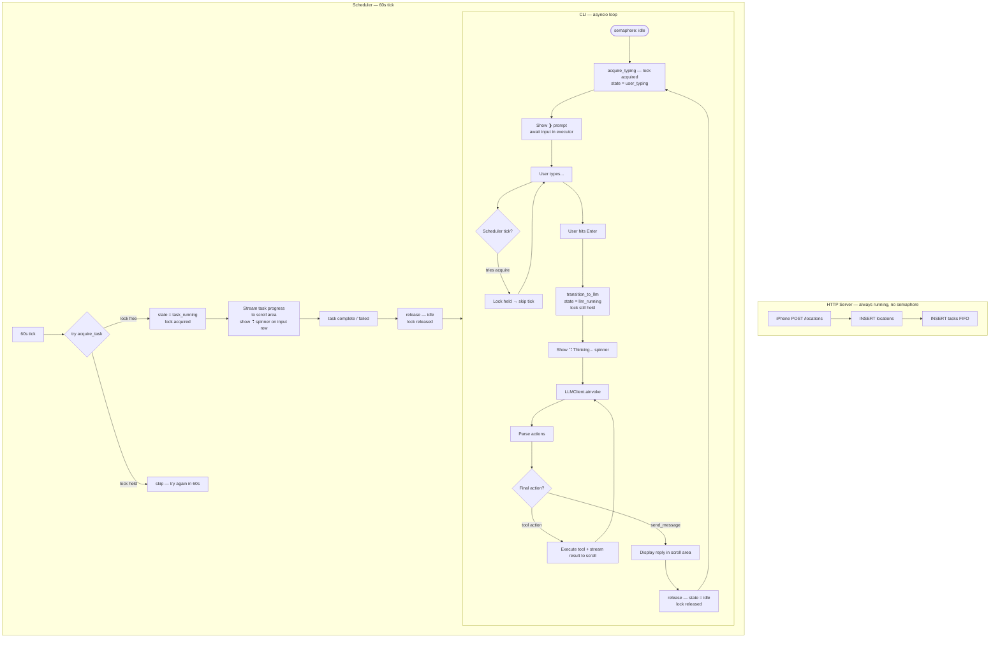
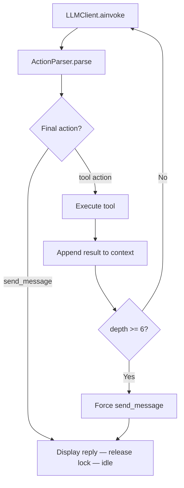
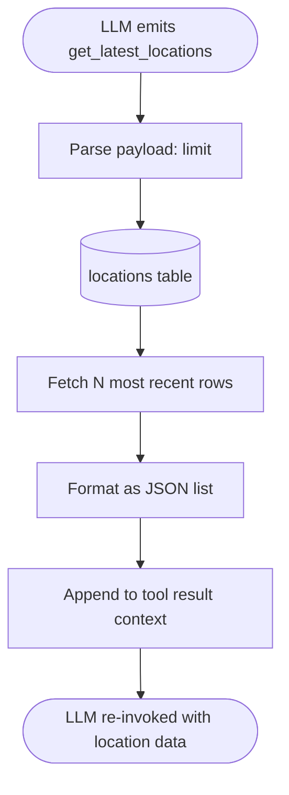
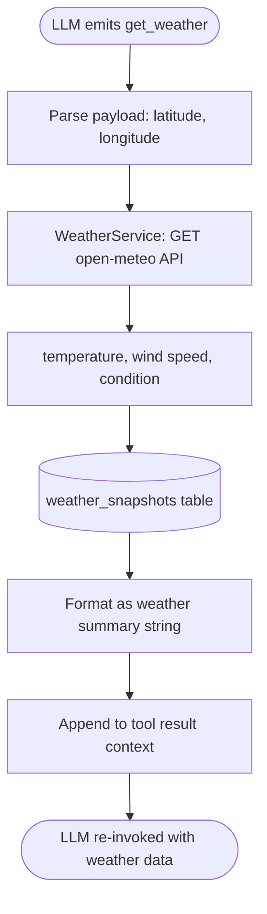
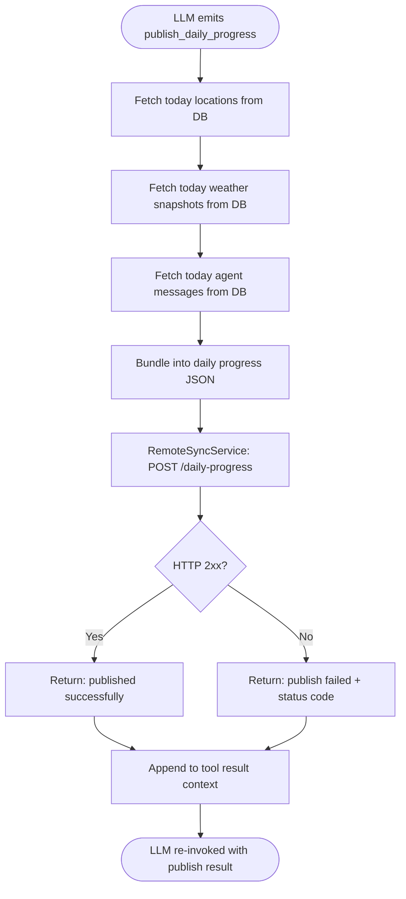
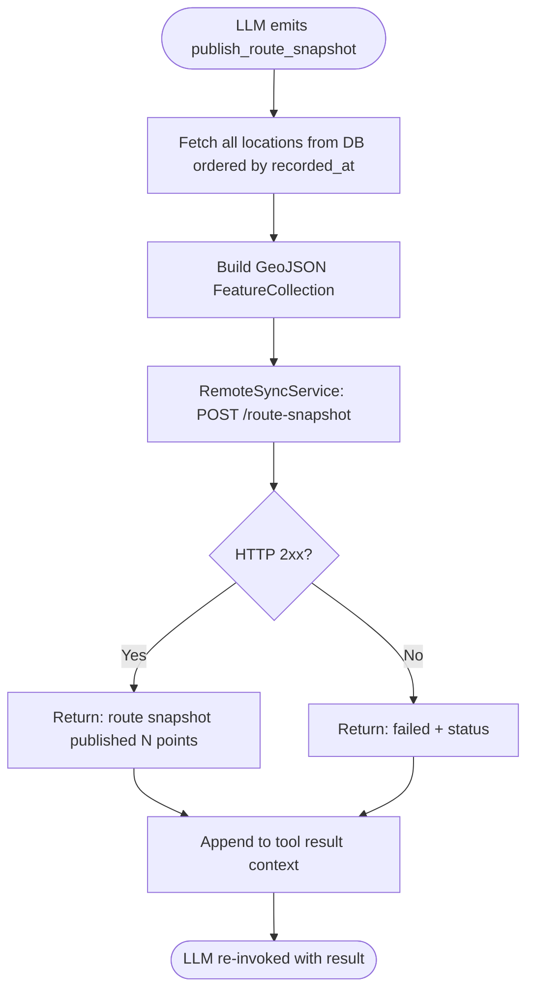
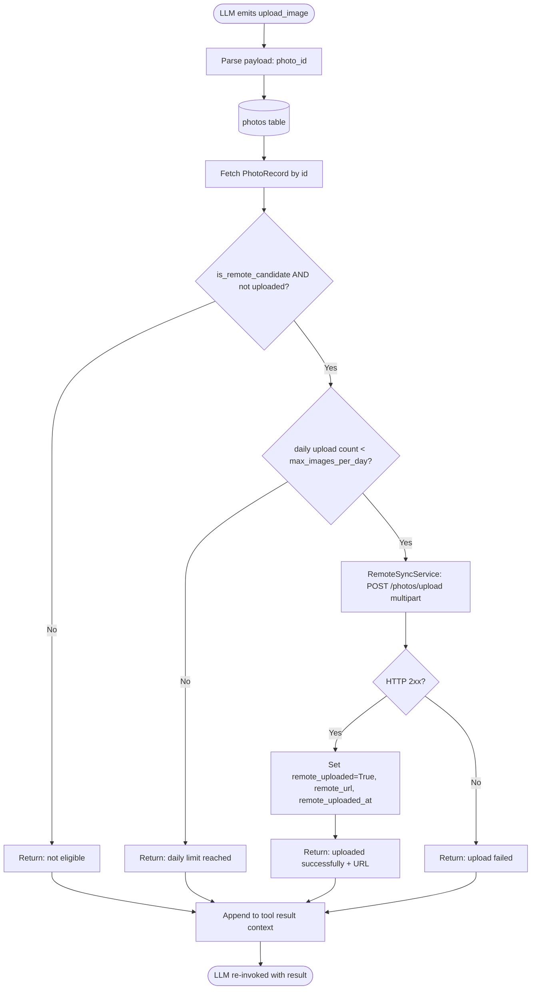
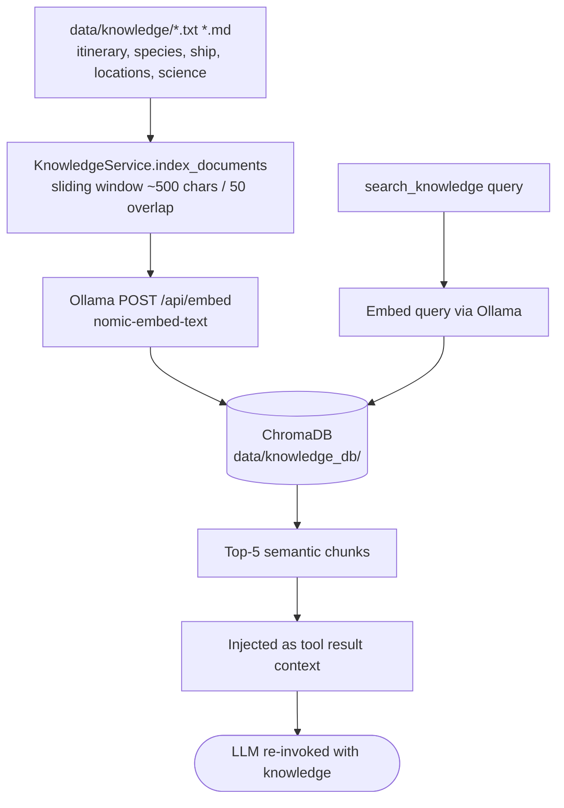

# Antarctic Expedition Agent

## Overview

Console-first autonomous expedition AI agent that tracks an Antarctic expedition in real time. An iPhone sends GPS coordinates via HTTP every hour; a scheduler collects weather four times daily; photos are ingested from an inbox, analyzed locally with a vision model (Ollama `qwen2.5-vl`), scored for significance via a second LLM call, and published selectively to a remote expedition website.

The LLM drives all decisions through **recursive tool chaining** — it calls tools in sequence, receives results, and keeps calling more tools before producing a final `send_message`. A shared execution semaphore prevents concurrent heavy operations. All state lives in SQLite. The existing conversational agent foundation (action-driven runtime, Pydantic models, CLI, Protocols) is extended — `collect_field` and `escalate` are not used in the expedition agent.

## Architecture

-   **Recursive Tool Chaining**: LLM emits actions → runtime executes tools → results appended to context → LLM invoked again → repeat until `send_message` or `max_chain_depth = 6`
-   **Execution Semaphore**: Four states (`idle`, `user_typing`, `llm_running`, `task_running`) — the asyncio lock is held continuously from the moment the CLI shows the `❯` prompt through the entire LLM reply; scheduler can only run in the brief window between a reply finishing and the next prompt appearing
-   **Task Scheduler**: 60-second tick loop; generates due weather tasks; picks the oldest pending task (FIFO, no priority); streams task progress to the scroll area while blocking the input prompt
-   **HTTP Server is lock-free**: the HTTP server runs completely outside the semaphore — GPS coordinates are always stored and tasks always queued regardless of what the CLI is doing
-   **HTTP Ingestion**: asyncio HTTP server (`POST /locations`) receives GPS from iPhone shortcut → inserts `process_location` task into `tasks` table
-   **Repository Pattern**: Six SQLite tables each with a dedicated async repository (`aiosqlite`); fully decoupled from conversation state
-   **All-Local LLM**: Ollama handles all LLM operations — `qwen2.5-vl` for vision description, a text model (e.g. `qwen2.5`) for chat and significance scoring; no external API calls
-   **Remote Publishing**: Railway API receives daily JSON, route snapshots, weather snapshots, selected photos, and agent messages via multipart/form-data
-   **Protocol-Based**: `LLMClient`, `StateStore`, `OutputHandler` remain swappable; all services follow constructor injection

## Execution & Semaphore Model

The semaphore lock is held for all four non-idle states. The HTTP server is the only component that never touches the semaphore.



### Key invariant

The CLI acquires the lock **before** showing the `❯` prompt and holds it until the agent finishes replying. This means:

- **Typing** → lock held → scheduler cannot run
- **Enter pressed** → lock stays held, state transitions to `llm_running`
- **Agent replies** → lock released → scheduler gets one chance to run before CLI re-acquires for the next prompt
- **Task running** → lock held → CLI waits at `acquire_typing()` showing the spinner; task progress streams to scroll area

The HTTP server **never touches the lock** — GPS coordinates are always stored and tasks always queued, even mid-sentence.

## Conversation Flow



## Actions

---

### `get_latest_locations`

Returns the most recent GPS locations from the `locations` table.



---

### `get_locations_by_date`

Returns all GPS locations recorded on a specific date.


---

### `get_photos`

Returns photo records from the `photos` table, optionally filtered by status or date.


---

### `get_weather`

Fetches current weather from Open-Meteo for given coordinates and stores a snapshot.



---

### `create_task`

Inserts a new task into the `tasks` table for deferred execution by the scheduler.


---

### `scan_photo_inbox`

Triggers immediate scan of the photo inbox directory and queues `process_photo` tasks for new files.


---

### `publish_daily_progress`

Bundles today's locations, weather snapshots, and agent messages into a JSON payload and POSTs to Railway.



---

### `publish_route_snapshot`

Sends a GeoJSON FeatureCollection of all recorded GPS coordinates to Railway.



---

### `upload_image`

Uploads a single remote-candidate photo to Railway as multipart/form-data.



---

### `publish_agent_message`

Saves an agent message to the DB and publishes it to Railway for the expedition website.


---

### `publish_weather_snapshot`

Publishes the most recent weather snapshot to Railway.


---

### `send_message` *(final action)*

Sends a message to the user. Always the last action in any chain.


---

## Project Structure

Files marked `[c19]`–`[c24]` are added by the corresponding planned commit.

```
src/agent/
├── __main__.py              — Entry point: starts CLI + HTTP server + scheduler concurrently
├── config/
│   └── loader.py            — Config: agent (+ timezone [c22]), photo_pipeline, image_preprocessing,
│                              weather, knowledge, remote_sync, http_server, scheduler, db sections
├── cli/
│   └── app.py               — Terminal UI: scroll area, spinner, status bar (↗ km today [c21])
├── db/
│   ├── database.py          — aiosqlite connection + init_all_tables()
│   ├── locations_repo.py    — LocationsRepository (locations table)
│   ├── photos_repo.py       — PhotosRepository (photos table)
│   ├── weather_repo.py      — WeatherRepository (weather_snapshots table)
│   ├── tasks_repo.py        — TasksRepository (tasks table — claim / complete / fail, FIFO)
│   ├── messages_repo.py     — MessagesRepository (agent_messages table)
│   └── activity_logs_repo.py [c20] — ActivityLogsRepository (activity_logs table)
├── http/
│   └── server.py            — asyncio HTTP server — POST /locations → GPS insert + task
├── llm/
│   ├── client.py            — LLMClient Protocol
│   ├── ollama.py            — OllamaClient — structured chat via /api/chat
│   ├── ollama_vision.py     — OllamaVisionClient — base64 image → description + summary
│   ├── openrouter.py        — OpenRouterClient (cloud fallback)
│   └── prompt_builder.py    — Builds system + user message context
├── models/
│   ├── actions.py           — 15 actions: 13 ToolAction subclasses + SendMessageAction + FinishAction
│   │                          tools: get_latest_locations, get_locations_by_date, get_photos,
│   │                                 get_weather, create_task, scan_photo_inbox,
│   │                                 search_knowledge, index_knowledge,
│   │                                 publish_daily_progress, publish_route_snapshot,
│   │                                 upload_image, publish_agent_message, publish_weather_snapshot
│   │                          [c20] + get_logs   [c21] + get_distance
│   ├── photo.py             — PhotoRecord
│   ├── location.py          — LocationRecord
│   ├── task.py              — TaskRecord (type, payload, status, created_at)
│   └── state.py             — ConversationState
├── runtime/
│   ├── runtime.py           — Recursive chaining loop + _dispatch_tool + auto-logging [c20]
│   ├── scheduler.py         — 60s tick loop — weather tasks + FIFO task execution
│   ├── semaphore.py         — ExecutionSemaphore (idle / user_typing / llm_running / task_running)
│   ├── task_runner.py       — Dispatches 9 task types to services
│   ├── parser.py            — ACTION_REGISTRY (15 actions; +2 in c20/c21)
│   └── protocols.py         — OutputHandler Protocol
├── services/
│   ├── image_preprocessing.py — EXIF correction + resize + SHA-256
│   ├── photo_service.py     — scan inbox → preprocess → vision → score → move
│   ├── weather_service.py   — Open-Meteo ECMWF fetch + DB persistence
│   ├── knowledge_service.py [c19] — ChromaDB + nomic-embed-text: index + search
│   ├── distance_service.py  [c21] — Haversine distance from GPS points
│   └── remote_sync_service.py [c24/postponed] — Railway API publishing
└── state/
    ├── store.py             — StateStore Protocol + MemoryStateStore
    └── file_store.py        — FileStateStore

configs/
└── expedition_config.json   — Full expedition agent config

data/
├── photos/
│   ├── inbox/               — Drop new photos here
│   ├── processed/           — Originals moved here after processing
│   └── vision_preview/      — Derived JPEG previews (for vision model)
├── knowledge/               — Drop .txt/.md expedition documents here [c19]
├── knowledge_db/            — ChromaDB persistent storage (auto-created) [c19]
└── expedition.db            — SQLite database
```

## Key Design Decisions

### Recursive tool chaining — LLM loops until `send_message`
The runtime keeps invoking the LLM until it emits `send_message`. After each non-final action, the tool result is appended to the message context as a `tool` role message. `max_chain_depth = 6` prevents infinite loops — at depth 6 a forced `send_message` is injected.

### Semaphore lock is held for the full user interaction cycle
The CLI calls `acquire_typing()` (which acquires the asyncio lock) before showing the `❯` prompt. When Enter is pressed, the state transitions to `llm_running` without releasing the lock. The lock is only released after the agent's final `send_message`. This guarantees the scheduler can never interrupt a conversation mid-reply, and can never fire while the user is typing. The scheduler gets at most one tick opportunity between the end of one reply and the start of the next prompt.

### Input prompt is blocked while a background task runs
When the scheduler picks up a task, it acquires the same lock. The CLI is then waiting at `acquire_typing()` — it cannot show the `❯` prompt until the task finishes. During this wait, the input row shows the spinner and task progress messages stream to the scroll area via `on_task_progress(message)`.

### Task system is DB-backed FIFO, no priority
Tasks persist in the `tasks` table (type, payload JSON, status, created_at). `claim_next()` picks the oldest `pending` task (`ORDER BY created_at ASC`). No priority field — insertion order is the only ordering guarantee. Survives restarts. The LLM (`create_task` action) and the HTTP server both enqueue tasks; neither is special-cased.

### HTTP server is completely independent of the semaphore
The asyncio HTTP server runs as a concurrent task and never acquires the semaphore. GPS coordinates from the iPhone are always stored and `process_location` tasks always queued immediately, regardless of what the CLI or scheduler is doing. The task queue accumulates freely; execution is just deferred until the lock is free.

### HTTP server uses asyncio — no framework dependency
`asyncio.start_server` with a minimal HTTP parser handles `POST /locations`. Single endpoint, no routing needed. Runs as a concurrent asyncio task. No `aiohttp` / `fastapi` dependency added.

### Photo pipeline: preview-first, never touch original

```mermaid
graph TD
    Inbox[data/photos/inbox/foto.jpg]
    Inbox --> Preprocess[ImagePreprocessingService\nEXIF correction + resize longest side 1280–1600px\nSHA-256 of original]
    Preprocess --> Preview[data/photos/vision_preview/foto_preview.jpg]
    Preview --> Vision[OllamaVisionClient\nqwen2.5vl:7b via /api/generate\nreturns plain-text description]
    Vision --> Score[Significance scoring\nqwen3.5:9b — structured JSON\n{"significance_score": 0.82}]
    Score --> DB[(photos table\nvision_description\nsignificance_score\nis_remote_candidate)]
    DB --> Move[Original moved to\ndata/photos/processed/foto.jpg]
    DB --> Gate{score >= 0.75?}
    Gate -->|yes| Candidate[is_remote_candidate = true\neligible for upload]
    Gate -->|no| Archive[archived only — not published]
```

`ImagePreprocessingService` (Pillow) generates a derived JPEG with EXIF orientation corrected and longest side 1280–1600px. The original is **never modified** — moved from `inbox/` to `processed/` after successful processing.

**Vision analysis**: `OllamaVisionClient` sends the preview as base64 to `qwen2.5vl:7b` via `/api/generate`. Returns plain-text description — no structured output needed.

**Significance scoring**: a second Ollama call (`qwen3.5:9b`) receives the description and returns `{"significance_score": float}`. Threshold `0.75` gates `is_remote_candidate`.

### Knowledge base — ChromaDB + Ollama embeddings



Documents are chunked (~500 chars, 50 char overlap), embedded locally via `nomic-embed-text` through Ollama, and stored in a persistent ChromaDB collection. `search_knowledge` embeds the query and returns the top-5 matching chunks. `index_knowledge` re-indexes all source documents (idempotent — upserts by doc ID).

---

### Remote publishing is policy-controlled
Upload constraints: max 3 images/batch, max 10/day. `RemoteSyncService` tracks daily count in the DB. `publish_daily_progress` bundles locations + weather + messages. `publish_route_snapshot` sends GeoJSON of all coordinates.

## Terminal Layout

```
Row 1..(N-3)  — Scroll area: chat messages, tool logs, task progress, scheduler events
Row N-2       — Rule separator ────────────────────────────────────────────────
Row N-1       — Input ❯  OR  ⠹ task: <name> — <current step>  (during semaphore hold)
Row N         — Status: session | scheduler: next | tasks: N pending | tokens: 1,234
```

-   Scroll region via ANSI `\033[1;{N-3}r` (unchanged from existing CLI)
-   When lock is held by a background task: input row shows spinner (no `❯`), CLI awaits lock release
-   When lock is released by task: CLI immediately acquires for next input, `❯` reappears
-   `on_task_progress(message)` appends task status lines to scroll area in real time during task execution
-   Status bar extended: pending task count

## Configuration

All behavior driven by a single JSON file passed via `--config`:

```json
{
  "agent": {
    "name", "greeting", "model": "qwen3.5:9b", "vision_model": "qwen2.5vl:7b",
    "temperature", "max_tokens",
    "timezone": "America/Argentina/Buenos_Aires"  // [c22]
  },
  "personality":  { "tone", "style", "formality", "emoji_usage", "prompt" },
  "actions":      { "available": ["...15 action definitions (+ get_logs [c20], get_distance [c21])..."] },
  "system_prompt": { "template", "dynamic_sections" },
  "runtime":      { "max_chain_depth": 6 },
  "http_server":  { "host": "0.0.0.0", "port": 8080 },
  "scheduler":    { "tick_interval_seconds": 60 },
  "db":           {},
  "photo_pipeline": {
    "significance_threshold": 0.75,
    "scoring_prompt": "...",
    "vision_prompt": "..."
    // paths from env: PHOTO_INBOX_DIR, PHOTO_PROCESSED_DIR, PHOTO_PREVIEW_DIR, OLLAMA_URL
  },
  "image_preprocessing": {
    "correct_exif_orientation": true,
    "vision_max_dimension": 800,
    "vision_min_dimension": 640,
    "vision_preview_format": "jpeg",
    "vision_preview_quality": 85
  },
  "weather": {
    "provider": "open-meteo",
    "latitude": -62.15,
    "longitude": -58.45,
    "schedule_hours": [6, 12, 18, 0]
  },
  "knowledge": {                  // [c19] — paths from env: KNOWLEDGE_CHROMA_DIR, KNOWLEDGE_SOURCE_DIR
    "embedding_model": "nomic-embed-text",
    "collection_name": "expedition",
    "chunk_size": 500,
    "chunk_overlap": 50,
    "n_results": 5
  },
  "remote_sync": {                // [c24/postponed] — from env: REMOTE_SYNC_BASE_URL, REMOTE_SYNC_API_KEY
    "max_images_per_batch": 3,
    "max_images_per_day": 10
  }
  // DB_PATH, OLLAMA_URL, HTTP_HOST, HTTP_PORT, SCHEDULER_TICK_SECONDS from env
}
```

## Commands

```bash
pip install -e ".[dev]"                                                   # install
python -m agent --config configs/expedition_config.json                   # run expedition agent
python -m agent --config configs/expedition_config.json --debug           # debug mode
python -m agent --config configs/example_config.json                      # existing configs unchanged
python -m agent --config configs/expedition_config.json --session <id>    # resume session
```

## Commit History

| #  | Description                                                                  | Status      |
|----|------------------------------------------------------------------------------|-------------|
| 1  | Project setup, core models, config loader, schemas                           | Done        |
| 2  | StateStore, OutputHandler, ActionParser, PromptBuilder                       | Done        |
| 3  | Runtime orchestrator                                                         | Done        |
| 4  | CLI interface with test mode                                                 | Done        |
| 5  | OpenRouter LLM client + system prompt engineering + debug mode               | Done        |
| 6  | FileStateStore + enhanced CLI (status bar, spinner, terminal layout)         | Done        |
| 7  | DB layer: aiosqlite + 6 table repos (locations, photos, weather, tasks, messages, sessions) | Done        |
| 8  | Models: LocationRecord, TaskRecord, PhotoRecord                              | Done        |
| 9  | Delete old configs + create expedition_config.json                           | Done        |
| 10 | HTTP server: POST /locations → process_location task                         | Done        |
| 11 | ExecutionSemaphore + Scheduler (60s tick, weather schedule)                  | Done        |
| 12 | Semaphore redesign (lock-based typing, 4 states) + FIFO tasks (no priority) + CLI async input + recursive runtime chaining | Done        |
| 13 | TaskRunner: dispatches all 9 task types + CLI task progress output           | Done        |
| 14 | OllamaClient + .env loading + provider config + DB wiring + scheduler/HTTP/semaphore all wired in __main__.py | Done        |
| 15 | WeatherService: Open-Meteo ECMWF full Antarctic fields + DB persistence + get_weather live fetch | Done        |
| 16 | CLI status bar: location + weather + precipitation + 5min auto-refresh       | Done        |
| 17 | ImagePreprocessingService (Pillow EXIF + resize + copy opt) + OllamaVisionClient (qwen2.5vl:7b) structured output (description + summary) | Done        |
| 18 | PhotoService: scan inbox, preprocess, vision, Ollama significance scoring, DB, move to processed | Done        |
| 19 | Embedding pipeline + `search_knowledge` / `index_knowledge` actions (ChromaDB + nomic-embed-text) | **Next**    |
| 20 | Activity log: auto-logging in Runtime + `get_logs` action                    | Planned     |
| 21 | Distance service: Haversine + `get_distance` action + status bar `↗ 14.2 km today` | Planned     |
| 22 | Timezone support: configurable `timezone` field (default `America/Argentina/Buenos_Aires`) | Planned     |
| 23 | Tests + documentation                                                        | Planned     |
| 24 | RemoteSyncService: Railway API publishing                                    | Postponed   |

---

## Commit 20 — Activity log: auto-logging + `get_logs` action

### Design decision
Logging is **infrastructure, not an agent action**. The Runtime automatically writes a log entry to the DB on every `_dispatch_tool()` call — no LLM tokens spent, no coverage gaps. The agent only uses `get_logs` to *read* logs (e.g., before publishing daily progress to know what happened during the day).

### New DB table: `activity_logs`

```sql
CREATE TABLE activity_logs (
    id          INTEGER PRIMARY KEY AUTOINCREMENT,
    session_id  TEXT,
    action_type TEXT NOT NULL,
    payload     TEXT,          -- JSON, truncated to 500 chars
    result      TEXT,          -- first 500 chars of tool result
    created_at  TEXT NOT NULL  -- ISO 8601 UTC
);
```

### New files

#### `src/agent/db/activity_logs_repo.py`
```
ActivityLogsRepository(db)
  insert(session_id, action_type, payload, result) → dict
  get_by_range(from_dt: datetime, to_dt: datetime) → list[dict]
  get_today(session_id?) → list[dict]
```

### Changed files

#### `src/agent/db/database.py`
Add `activity_logs` table to `init_all_tables()`.

#### `src/agent/runtime/runtime.py`
After every `_dispatch_tool()` returns, insert a log entry:
```python
await ActivityLogsRepository(self._db).insert(
    session_id=session_id,
    action_type=action_type,
    payload=json.dumps(payload)[:500],
    result=result[:500],
)
```

#### `src/agent/models/actions.py`
Add `GetLogsAction(ToolAction)` with `type = "get_logs"`.

#### `src/agent/runtime/parser.py`
Register `"get_logs": GetLogsAction`.

#### `src/agent/runtime/runtime.py`
Add `_tool_get_logs(payload)`:
```python
async def _tool_get_logs(self, payload: dict) -> str:
    from_dt = payload.get("from")   # ISO 8601 string
    to_dt   = payload.get("to")     # ISO 8601 string
    rows = await ActivityLogsRepository(self._db).get_by_range(from_dt, to_dt)
    return json.dumps(rows, ensure_ascii=False)
```

#### `configs/expedition_config.json`
Add `get_logs` action:
```json
{
  "type": "get_logs",
  "description": "Retrieve activity log entries for a time range. Use before publishing to summarize what happened during the day.",
  "parameters": {
    "payload.from": "ISO 8601 datetime string (UTC)",
    "payload.to":   "ISO 8601 datetime string (UTC)"
  }
}
```

---

## Commit 21 — Distance service: Haversine + `get_distance` + status bar

### Design

A `DistanceService` utility computes total traversed distance from an ordered list of GPS coordinates using the **Haversine formula**. All consecutive points are summed (no jump filtering — barco/vuelo included). "Today" boundary uses the configured timezone.

### New files

#### `src/agent/services/distance_service.py`
```
DistanceService(db, timezone: str)
  get_today_distance() → float                      # km, rounded to 1 decimal
  get_distance_for_date(date: str) → float           # km for a specific YYYY-MM-DD (in configured TZ)
  _haversine(lat1, lon1, lat2, lon2) → float         # km between two points
  _points_for_date(date_str: str) → list[dict]       # fetches from LocationsRepository ordered by recorded_at
```

Haversine formula (standard GPS distance):
```
a = sin²(Δlat/2) + cos(lat1)·cos(lat2)·sin²(Δlon/2)
c = 2·atan2(√a, √(1−a))
d = R·c   where R = 6371 km
```

### Changed files

#### `src/agent/models/actions.py`
Add `GetDistanceAction(ToolAction)` with `type = "get_distance"`.

#### `src/agent/runtime/parser.py`
Register `"get_distance": GetDistanceAction`.

#### `src/agent/runtime/runtime.py`
Add `_tool_get_distance(payload)`:
```python
async def _tool_get_distance(self, payload: dict) -> str:
    from agent.services.distance_service import DistanceService
    date = payload.get("date")  # optional YYYY-MM-DD; defaults to today
    tz = self._config.agent.timezone
    svc = DistanceService(self._db, tz)
    if date:
        km = await svc.get_distance_for_date(date)
    else:
        km = await svc.get_today_distance()
    return f"{km} km"
```

#### `src/agent/cli/app.py`
In `_build_status_text()`, call `DistanceService.get_today_distance()` and append `↗ {km} km today` to the status bar.

#### `src/agent/config/loader.py`
Add `timezone: str` to `AgentConfig`:
```python
timezone: str = "America/Argentina/Buenos_Aires"
```

#### `configs/expedition_config.json`
Add `"timezone": "America/Argentina/Buenos_Aires"` to the `agent` section.
Add `get_distance` action:
```json
{
  "type": "get_distance",
  "description": "Calculate total distance traveled (km) from GPS points. Defaults to today. Pass payload.date (YYYY-MM-DD) for a specific day.",
  "parameters": {
    "payload.date": "optional YYYY-MM-DD"
  }
}
```

#### Status bar output example
```
abc123 · -62.15, -58.45 · -4.2°C (feels -11.0°C) ❄  ↗ 14.2 km today
```

### Timezone handling
- `"today"` boundaries are computed in the configured `timezone` using the `zoneinfo` stdlib module (Python 3.9+)
- `zoneinfo.ZoneInfo("America/Argentina/Buenos_Aires")` — UTC-3, no DST
- No new dependency needed (stdlib since 3.9; fallback: `pip install tzdata` on some systems)

```python
from zoneinfo import ZoneInfo
from datetime import datetime, timezone as tz

def _today_in_tz(timezone_str: str) -> str:
    tz_obj = ZoneInfo(timezone_str)
    return datetime.now(tz=tz_obj).strftime("%Y-%m-%d")
```

---
