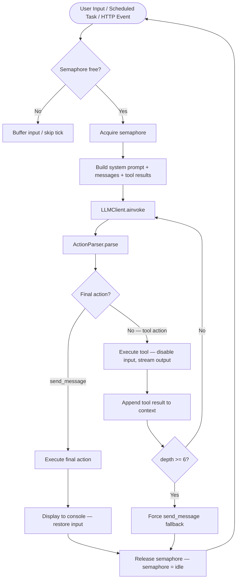
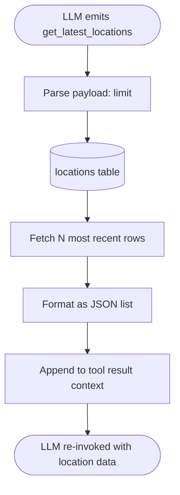
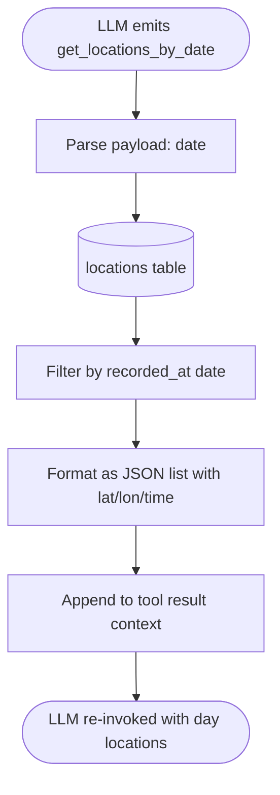
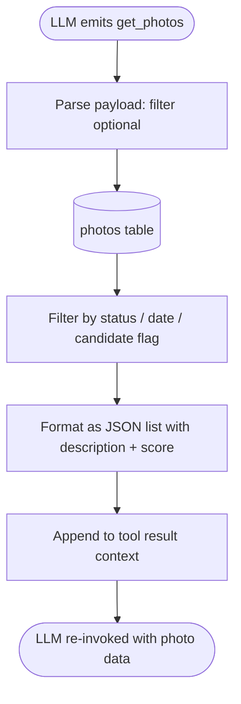
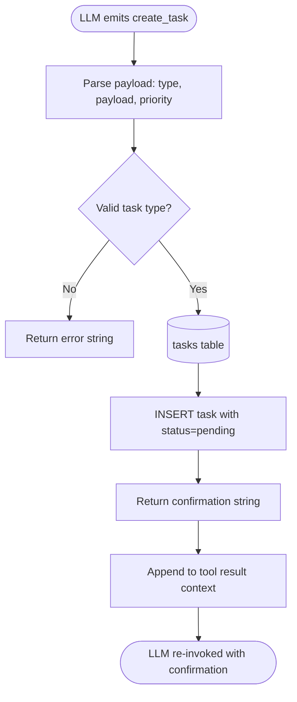
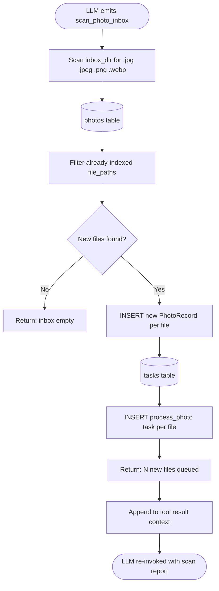
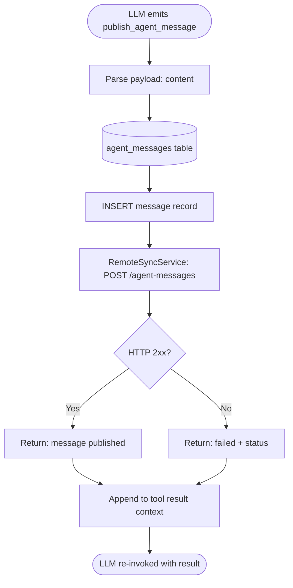
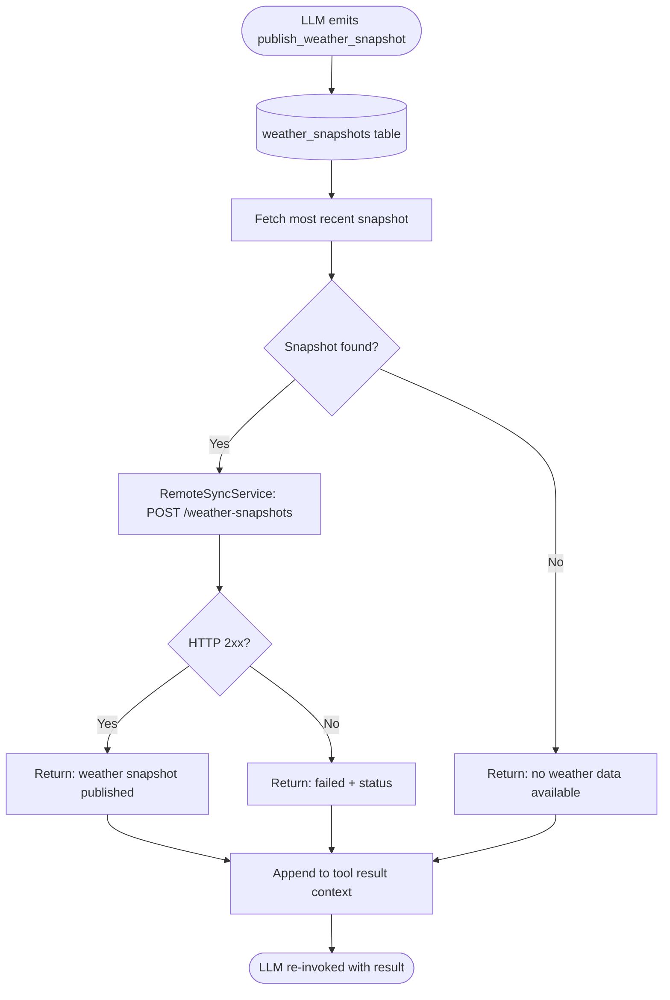
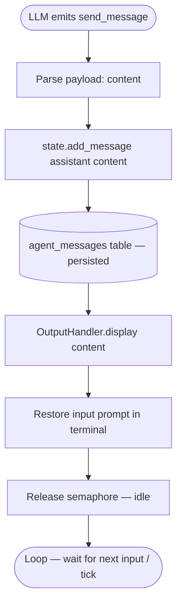

# Antarctic Expedition Agent

## Overview

Console-first autonomous expedition AI agent that tracks an Antarctic expedition in real time. An iPhone sends GPS coordinates via HTTP every hour; a scheduler collects weather four times daily; photos are ingested from an inbox, analyzed locally with a vision model (Ollama `qwen2.5-vl`), scored for significance via a second LLM call, and published selectively to a remote expedition website.

The LLM drives all decisions through **recursive tool chaining** — it calls tools in sequence, receives results, and keeps calling more tools before producing a final `send_message`. A shared execution semaphore prevents concurrent heavy operations. All state lives in SQLite. The existing conversational agent foundation (action-driven runtime, Pydantic models, CLI, Protocols) is extended — `collect_field` and `escalate` are not used in the expedition agent.

## Architecture

-   **Recursive Tool Chaining**: LLM emits actions → runtime executes tools → results appended to context → LLM invoked again → repeat until `send_message` or `max_chain_depth = 6`
-   **Execution Semaphore**: Three states (`idle`, `llm_running`, `task_running`) — only one heavy process at a time; scheduler pauses when busy; console input disabled and shows task progress when busy
-   **Task Scheduler**: 5-second tick loop; generates due tasks (weather 4×/day); picks highest-priority pending task; streams execution output to terminal
-   **HTTP Ingestion**: asyncio HTTP server (`POST /locations`) receives GPS from iPhone shortcut → inserts `process_location` task into `tasks` table
-   **Repository Pattern**: Six SQLite tables each with a dedicated async repository (`aiosqlite`); fully decoupled from conversation state
-   **All-Local LLM**: Ollama handles all LLM operations — `qwen2.5-vl` for vision description, a text model (e.g. `qwen2.5`) for chat and significance scoring; no external API calls
-   **Remote Publishing**: Railway API receives daily JSON, route snapshots, weather snapshots, selected photos, and agent messages via multipart/form-data
-   **Protocol-Based**: `LLMClient`, `StateStore`, `OutputHandler` remain swappable; all services follow constructor injection

## Conversation Flow



## Actions

---

### `get_latest_locations`

Returns the most recent GPS locations from the `locations` table.



---

### `get_locations_by_date`

Returns all GPS locations recorded on a specific date.



---

### `get_photos`

Returns photo records from the `photos` table, optionally filtered by status or date.



---

### `get_weather`

Fetches current weather from Open-Meteo for given coordinates and stores a snapshot.


---

### `create_task`

Inserts a new task into the `tasks` table for deferred execution by the scheduler.



---

### `scan_photo_inbox`

Triggers immediate scan of the photo inbox directory and queues `process_photo` tasks for new files.



---

### `publish_daily_progress`

Bundles today's locations, weather snapshots, and agent messages into a JSON payload and POSTs to Railway.


---

### `publish_route_snapshot`

Sends a GeoJSON FeatureCollection of all recorded GPS coordinates to Railway.


---

### `upload_image`

Uploads a single remote-candidate photo to Railway as multipart/form-data.


---

### `publish_agent_message`

Saves an agent message to the DB and publishes it to Railway for the expedition website.



---

### `publish_weather_snapshot`

Publishes the most recent weather snapshot to Railway.



---

### `send_message` *(final action)*

Sends a message to the user. Always the last action in any chain.



---

## Project Structure

```
src/agent/
├── __main__.py              — Entry point: starts CLI + HTTP server + scheduler concurrently
├── config/
│   └── loader.py            — Extended Config: http_server, scheduler, photo_pipeline,
│                              image_preprocessing, weather, remote_sync, runtime sections
├── cli/
│   └── app.py               — CLI with terminal layout, spinner, task output streaming,
│                              input disabled during task_running
├── db/
│   ├── database.py          — aiosqlite connection + init_all_tables()
│   ├── locations_repo.py    — LocationsRepository (locations table)
│   ├── photos_repo.py       — PhotosRepository (photos table)
│   ├── weather_repo.py      — WeatherRepository (weather_snapshots table)
│   ├── tasks_repo.py        — TasksRepository (tasks table — claim / complete / fail)
│   └── messages_repo.py     — MessagesRepository (agent_messages table)
├── http/
│   └── server.py            — asyncio HTTP server — POST /locations → inserts task
├── llm/
│   ├── client.py            — LLMClient Protocol (unchanged)
│   ├── ollama.py            — OllamaClient — text chat + vision (base64 image) via /api/chat
│   └── prompt_builder.py    — Extended: injects location / weather / task context
├── models/
│   ├── actions.py           — 12 action types (11 tools + send_message)
│   ├── photo.py             — PhotoRecord (mirrors photos table)
│   ├── location.py          — LocationRecord
│   ├── task.py              — TaskRecord (type, payload, status, priority)
│   └── state.py             — ConversationState (unchanged)
├── runtime/
│   ├── runtime.py           — Recursive chaining loop + full RESPONSE_FORMAT schema
│   ├── scheduler.py         — 5s tick loop — generates weather / publish tasks
│   ├── semaphore.py         — ExecutionSemaphore (idle / llm_running / task_running)
│   ├── task_runner.py       — Dispatches 9 task types to services
│   ├── parser.py            — Extended ACTION_REGISTRY (12 actions)
│   └── protocols.py         — OutputHandler Protocol (unchanged)
├── services/
│   ├── photo_service.py     — ImagePreprocessingService + full photo pipeline orchestration
│   ├── weather_service.py   — Open-Meteo API client (httpx)
│   └── remote_sync_service.py — Railway API publishing
└── state/
    ├── store.py             — StateStore Protocol + MemoryStateStore (unchanged)
    └── file_store.py        — FileStateStore (unchanged)

configs/
└── expedition_config.json   — Full expedition agent config

data/
├── photos/
│   ├── inbox/               — Drop new photos here
│   ├── processed/           — Originals moved here after success
│   └── vision_preview/      — Derived preview JPEGs
└── expedition.db            — Single SQLite database


```

## Key Design Decisions

### Recursive tool chaining — LLM loops until `send_message`
The runtime keeps invoking the LLM until it emits `send_message`. After each non-final action, the tool result is appended to the message context as a `tool` role message. `max_chain_depth = 6` prevents infinite loops — at depth 6 a forced `send_message` is injected.

### Input disabled during any semaphore hold
When `task_running` or `llm_running`, the CLI replaces the input row with a live status line: `⠹ task: scan_photo_inbox — step 2/7: running vision...`. Each task step calls `on_task_progress(step, detail)` on the `OutputHandler`, which streams to the scroll area in real time. Input is restored only when the semaphore returns to `idle`.

### Task system is DB-backed, not in-memory
Tasks persist in the `tasks` SQLite table (type, payload JSON, status, priority, created_at). Survives restarts. `TaskRunner` claims a task (`status=running`), executes it step by step, then marks `completed` or `failed`. Both the LLM (`create_task` action) and the HTTP server can enqueue tasks.

### HTTP server uses asyncio — no framework dependency
`asyncio.start_server` with a minimal HTTP parser handles `POST /locations`. Single endpoint, no routing needed. Runs as a concurrent asyncio task. No `aiohttp` / `fastapi` dependency added.

### Photo pipeline: preview-first, never touch original
`ImagePreprocessingService` (Pillow) generates a derived JPEG with EXIF orientation corrected and longest side 1280–1600px. Ollama `qwen2.5-vl` receives the preview as base64 and returns a description. A second Ollama call (text model) scores significance (`{"significance_score": float}`). Threshold `0.75` gates `is_remote_candidate`.

### Remote publishing is policy-controlled
Upload constraints: max 3 images/batch, max 10/day. `RemoteSyncService` tracks daily count in the DB. `publish_daily_progress` bundles locations + weather + messages. `publish_route_snapshot` sends GeoJSON of all coordinates.

## Terminal Layout

```
Row 1..(N-3)  — Scroll area: chat messages, tool logs, task progress, scheduler events
Row N-2       — Rule separator ────────────────────────────────────────────────
Row N-1       — Input ❯  OR  ⠹ task: <name> — <current step>  (during semaphore hold)
Row N         — Status: session | scheduler: next | tasks: N pending | tokens: 1,234
```

-   Scroll region via ANSI `\033[1;{N-3}r` (unchanged from existing CLI)
-   When `semaphore != idle`: input row shows spinner + task name + current step (no `❯`)
-   `on_task_progress(step, detail)` prints each step to scroll area in real time
-   Input is buffered (not discarded) during semaphore hold; processed after `idle`
-   Status bar extended: scheduler next-tick time + pending task count

## Configuration

All behavior driven by a single JSON file passed via `--config`:

```json
{
  "agent":        { "name", "greeting", "model", "temperature", "max_tokens" },
  "personality":  { "tone", "style", "formality", "emoji_usage", "prompt" },
  "actions":      { "available": ["...all 12 action definitions..."] },
  "system_prompt": { "template", "dynamic_sections" },
  "runtime":      { "max_chain_depth": 6 },
  "http_server":  { "host": "0.0.0.0", "port": 8080 },
  "scheduler":    { "tick_interval_seconds": 5 },
  "db":           { "path": "./data/expedition.db" },
  "photo_pipeline": {
    "inbox_dir": "./data/photos/inbox",
    "processed_dir": "./data/photos/processed",
    "vision_preview_dir": "./data/photos/vision_preview",
    "ollama_url": "http://localhost:11434",
    "ollama_model": "qwen2.5-vl",
    "significance_threshold": 0.75,
    "vision_prompt": "Describe this expedition photo in detail."
  },
  "image_preprocessing": {
    "correct_exif_orientation": true,
    "vision_max_dimension": 1600,
    "vision_min_dimension": 1280,
    "vision_preview_format": "jpeg",
    "vision_preview_quality": 85
  },
  "weather": {
    "provider": "open-meteo",
    "latitude": -62.15,
    "longitude": -58.45,
    "schedule_hours": [6, 12, 18, 0]
  },
  "remote_sync": {
    "base_url": "https://your-railway-app.railway.app",
    "api_key_env": "REMOTE_SYNC_API_KEY",
    "max_images_per_batch": 3,
    "max_images_per_day": 10
  }
}
```

## Commands

```bash
pip install -e ".[dev]"                                                   # install
python -m agent --config configs/expedition_config.json                   # run expedition agent
python -m agent --config configs/expedition_config.json --debug           # debug mode
python -m agent --config configs/example_config.json                      # existing configs unchanged
python -m agent --config configs/expedition_config.json --session <id>    # resume session
```

## Commit History

| #  | Description                                                                  | Status   |
|----|------------------------------------------------------------------------------|----------|
| 1  | Project setup, core models, config loader, schemas                           | Done     |
| 2  | StateStore, OutputHandler, ActionParser, PromptBuilder                       | Done     |
| 3  | Runtime orchestrator                                                         | Done     |
| 4  | CLI interface with test mode                                                 | Done     |
| 5  | OpenRouter LLM client + system prompt engineering + debug mode               | Done     |
| 6  | FileStateStore + enhanced CLI (status bar, spinner, terminal layout)         | Done     |
| 7  | DB layer: aiosqlite + 6 table repos (locations, photos, weather, tasks, messages, sessions) | Done     |
| 8  | Models: LocationRecord, TaskRecord, PhotoRecord                              | Done     |
| 9  | HTTP server: POST /locations → process_location task                         | Planned  |
| 10 | ExecutionSemaphore + Scheduler (5s tick, weather schedule)                   | Planned  |
| 11 | Recursive runtime chaining (max_depth=6, tool result context appending)      | Planned  |
| 12 | TaskRunner: dispatches all 9 task types + CLI task progress output           | Planned  |
| 13 | ImagePreprocessingService (Pillow EXIF + resize) + OllamaVisionClient        | Planned  |
| 14 | PhotoService: full pipeline orchestration + significance scoring             | Planned  |
| 15 | WeatherService: Open-Meteo fetch + DB persistence                            | Planned  |
| 16 | All 12 actions wired + RESPONSE_FORMAT schema + expedition_config.json       | Planned  |
| 17 | RemoteSyncService: Railway API publishing                                    | Planned  |
