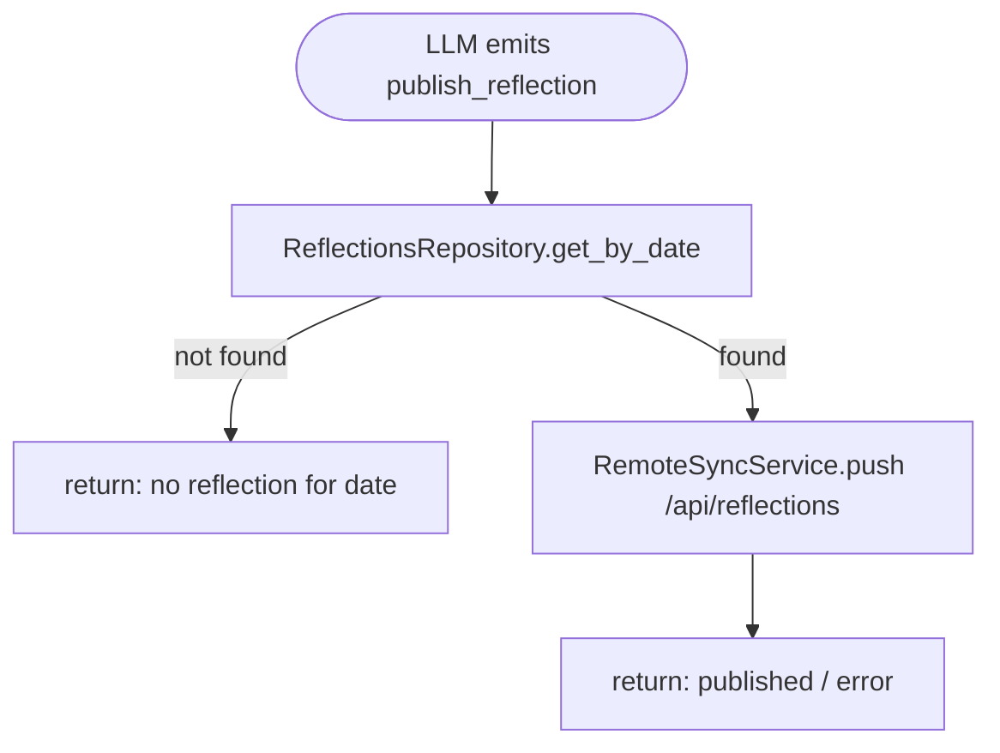
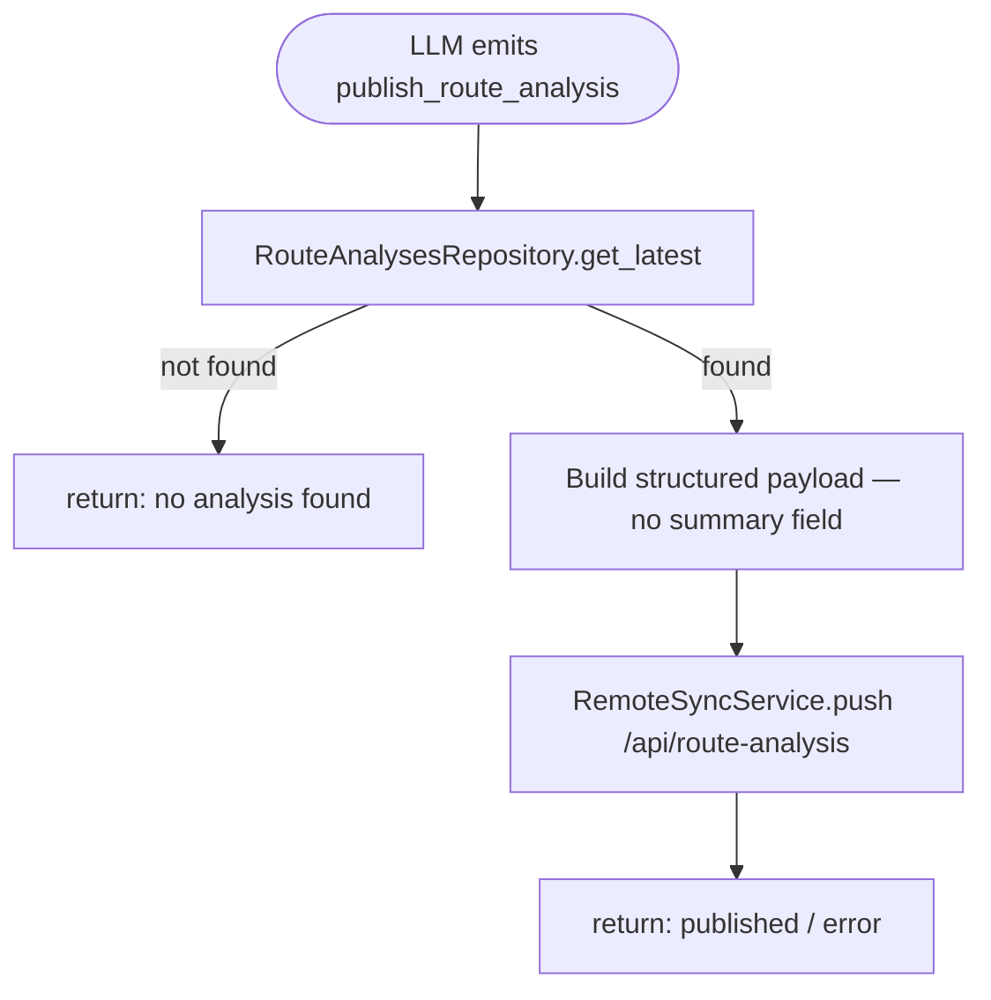
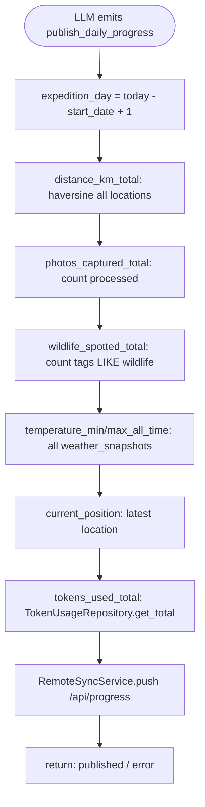

# Antarctic Expedition Agent — Phase 2

## Phase 1 Summary (c1–c27.5)

Phase 1 built the full local agent stack: core runtime with recursive tool chaining, SQLite DB, CLI with status bar and spinner, HTTP server for iPhone GPS ingestion, photo pipeline (scan → preprocess → vision → scoring → move), weather fetching, embedding-based knowledge base, activity logging, distance calculation, token usage tracking, route analysis (bearing/speed/wind/nearest sites), daily reflection, and the terminal scroll/semaphore model. All LLM calls are local via Ollama.

---

## Overview

Phase 2 completes the **outbound publishing layer** (agent → Railway server). Photos gain GPS coordinates at processing time and tags for wildlife classification. Four publish actions are properly implemented. Token usage is reported in the progress payload.

---

## Commit History

| #    | Description                                                                                        | Status              |
|------|----------------------------------------------------------------------------------------------------|---------------------|
| 1    | Project setup, core models, config loader                                                          | ✅ Done             |
| 2    | StateStore, OutputHandler, ActionParser, PromptBuilder                                             | ✅ Done             |
| 3    | Runtime orchestrator                                                                               | ✅ Done             |
| 4    | CLI interface                                                                                      | ✅ Done             |
| 5    | OllamaClient + system prompt engineering                                                           | ✅ Done             |
| 6    | FileStateStore + enhanced CLI (status bar, spinner, terminal layout)                               | ✅ Done             |
| 7    | DB layer: aiosqlite + 6 repos (locations, photos, weather, tasks, messages, sessions)              | ✅ Done             |
| 8    | Models: LocationRecord, TaskRecord, PhotoRecord                                                     | ✅ Done             |
| 9    | expedition_config.json                                                                             | ✅ Done             |
| 10   | HTTP server: POST /locations → process_location task                                               | ✅ Done             |
| 11   | ExecutionSemaphore + Scheduler (60s tick, weather schedule)                                        | ✅ Done             |
| 12   | Semaphore redesign + FIFO tasks + CLI async input + recursive runtime chaining                     | ✅ Done             |
| 13   | TaskRunner: dispatches all task types + CLI task progress output                                   | ✅ Done             |
| 14   | OllamaClient + .env + DB wiring + scheduler/HTTP/semaphore in \_\_main\_\_                        | ✅ Done             |
| 15   | WeatherService: Open-Meteo ECMWF + DB persistence + `get_weather`                                 | ✅ Done             |
| 16   | CLI status bar: location + weather + precipitation + 5min auto-refresh                             | ✅ Done             |
| 17   | ImagePreprocessingService (Pillow EXIF + resize) + OllamaVisionClient (qwen2.5vl:7b)              | ✅ Done             |
| 18   | PhotoService: scan inbox → preprocess → vision → scoring → move                                   | ✅ Done             |
| 19   | Knowledge pipeline: ChromaDB + nomic-embed-text + `search_knowledge` / `index_knowledge`          | ✅ Done             |
| 20   | Activity log: auto-logging all tool calls + `get_logs` action                                     | ✅ Done             |
| 21   | Distance service: Haversine + `get_distance` action + status bar `↗ km today`                    | ✅ Done             |
| 21.5 | Token usage: all LLM calls logged to DB + global counter + status bar + `get_token_usage`        | ✅ Done             |
| 21.6 | Scroll region fix: `_scroll_row` tracking + `_readline_active` split                              | ✅ Done             |
| 22   | Soul prompt: agent identity injected in every LLM call                                            | ⏸️ Postponed        |
| 23   | `add_location`: manual GPS insertion (fallback when iPhone fails)                                  | ✅ Done             |
| 24   | Daily reflection: `create_reflection` action + scheduled once-a-day task                           | ✅ Done             |
| 25   | Twitter/X: `post_tweet` + `tweet_image` actions                                                   | ⏸️ Postponed        |
| 26   | Photo appreciation: emotional/scientific appraisal added to vision                                | ⏸️ Postponed        |
| 27   | Route analysis: `analyze_route` + `get_route_analysis` + scheduled every 12h                      | ✅ Done             |
| 27.5 | Semaphore fix: remove `_poll_typing` + task spinner during background tasks                       | ✅ Done             |
| 27.6 | Prompt improvements (personality, vision, scoring, system_prompt, actions) + eval framework      | ✅ Done             |
| 28   | Photo model: latitude + longitude at process time + `tags` column + `get_wildlife_count`          | ✅ Done             |
| 29   | RemoteSyncService + config (`base_url_env` lazy fix) + `get_all_time_temps` DB helper             | ✅ Done             |
| 30   | `publish_reflection` + `comment` + `publish_weather_snapshot` + reflection dedup on restart       | ✅ Done             |
| 30.5 | Scoring: cetaceans in HIGH range + calibration examples (whale 0.85, orca 0.90)                  | ✅ Done             |
| 30.6 | Network indicator `⬆ N` in status bar + `is_network` in activity_logs + SERVER_HOST env var      | ✅ Done             |
| 31   | Route publishes: `publish_route_analysis` + `publish_route_snapshot` (per-point via task queue)  | ✅ Done             |
| 31.5 | sync_queue (100 retries) + auto-sync on fetch_weather + analyze_route queues publish tasks       | ✅ Done             |
| 31.6 | ID-based sync: every task payload carries DB record ID to avoid get_latest() drift offline       | ✅ Done             |
| 31.7 | `POST /api/location` per-point replacing deprecated `POST /api/track` (410)                      | ✅ Done             |
| 31.8 | `publish_route_snapshot` sends single point; `process_location` queues task with `location_id`  | ✅ Done             |
| 31.9 | Fix: all `_publish_*` log "queued for retry" vs "published" vs "error" distinctly               | ✅ Done             |
| 31.10| Reflection: create+publish flow fixed; richer context (weather/date, messages); new prompt       | ✅ Done             |
| 32.1 | `agent_quote` generated at scoring time — single JSON invocation returns score + quote           | ✅ Done             |
| 32.2 | Vision+scoring merged into single model call; model→`qwen2.5vl:3b`; `think:False`; prompts compacted | ✅ Done         |
| 32.3 | `sync_queue` photo support: `type` + `file_path` columns; `enqueue_photo()`; `retry_pending()` handles multipart | ✅ Done |
| 32.4 | `upload_image`: auto-queue at scoring if candidate; `task_runner` does multipart POST via `push_photo()` | ✅ Done  |
| 32.5 | Rich vision result display block in photo pipeline                                                | ✅ Done             |
| 32.6 | fix(tz): Argentina timezone everywhere — UTC range queries, `utils/tz.py`, `file_name` field fix | ✅ Done             |
| 33   | Twitter/X integration                                                                             | 📋 Planned          |

---

## Actions (Phase 2 additions)

### `publish_reflection`

Reads today's (or specified date's) reflection from DB and POSTs to `/api/reflections`.



Parameters: `payload.date` — optional YYYY-MM-DD, defaults to today.

---

### `publish_route_analysis`

Reads latest (or date-specific) route analysis from DB and POSTs to `/api/route-analysis`.



Parameters: `payload.date` — optional YYYY-MM-DD.

---

### `publish_daily_progress` (reimplemented)

Aggregates all-expedition running totals and POSTs to `/api/progress`.



---

## Commit 27.6 — Prompt improvements + eval framework

### Design

All four major prompts were rewritten to reflect Antartia's identity as the first AI operating from within Antarctica. The eval framework provides an LLM-as-judge pipeline for regression testing the agent against a golden dataset.

**Prompt changes:**
- `personality.prompt` — adventurous, witnessing, fascinated; short dense sentences; precise emotional register; awareness of being first AI in Antarctica
- `system_prompt.template` — added Workflow section; removed duplicate prose; merged rules 7+8 into single "learn constantly" rule; action descriptions tightened
- `vision_prompt` — structured field observation format with labeled sections (SUBJECT / BEHAVIOR / ENVIRONMENT / ATMOSPHERE / COMPOSITION / VESSEL / HUMAN PRESENCE); minimum 5–7 sentences; taxonomic precision
- `scoring_prompt` — expedition significance framing with calibration guidance (most photos 0.40–0.70, 0.85+ reserved); agent fascination included; special case for photos showing the Antartia system itself

**Eval framework:**
- `eval/runner.py` — `call_agent()` (Ollama) + `call_judge()` (OpenRouter GPT-4o-mini) + `run_case()`
- `eval/prompts.py` — mock state/knowledge for agent; judge system prompt; per-case scoring rubric (tool_sequence / output_quality / persona, 0–10)
- `eval/reporter.py` — Rich terminal reporter with panels, score bars, per-category breakdown
- `run_evals.py` — CLI with `--category`, `--id`, `--limit`, `--verbose`, `--concurrency`; Rich Live display with live pass/fail counts; auto-saves JSON run to `data/evals/runs/<timestamp>_<hex>.json`
- `data/evals/datasets/golden_dataset.csv` — 40 cases across 9 categories: navigation, weather, photos, knowledge, reflection, publishing, error_handling, identity, learning
- `EVAL_JUDGE_MODEL` env var; concurrency default=1 (thinking mode compatibility); `read=None` timeout on all Ollama calls

### New files

| File | Description |
|------|-------------|
| `eval/__init__.py` | Package init |
| `eval/runner.py` | Agent + judge LLM callers, `run_case()` |
| `eval/prompts.py` | Mock state/knowledge + judge prompts |
| `eval/reporter.py` | Rich terminal summary reporter |
| `run_evals.py` | CLI eval runner with Live display |
| `data/evals/datasets/golden_dataset.csv` | 40-case golden dataset |

### Test

```bash
source .venv/bin/activate && python3 run_evals.py --limit 5
# Expect: Rich panel header, live table growing with scores, run saved to data/evals/runs/

python3 run_evals.py --category navigation
# Filter to navigation cases only
```

---

## Commit 28 — Photo model: GPS at process time + tags

### Design

Photos are geo-tagged at **processing time** (when vision + scoring runs), not at upload. This captures where the ship was when the photo was discovered — more semantically meaningful than the upload moment (which can happen hours or days later).

Tags are stored as a JSON array in a `tags TEXT` column (e.g. `["wildlife","penguin"]`). Agent sets tags explicitly at `upload_image` time. No auto-tagging in this commit.

### Changed files

#### `src/agent/db/database.py`

Add migrations for three new photo columns (after existing `agent_quote` migration):
```python
for col in ("latitude REAL", "longitude REAL", "tags TEXT"):
    try:
        await self._conn.execute(f"ALTER TABLE photos ADD COLUMN {col}")
    except Exception:
        pass
```

#### `src/agent/db/photos_repo.py`

Add `get_wildlife_count()`:
```python
async def get_wildlife_count(self) -> int:
    """Count photos tagged with 'wildlife'."""
    async with self._db.conn.execute(
        "SELECT COUNT(*) FROM photos WHERE tags LIKE '%wildlife%'"
    ) as cur:
        row = await cur.fetchone()
    return row[0] if row else 0
```

#### `src/agent/services/photo_service.py`

At the end of `process_photo()`, before the final `repo.update()` call, fetch the latest GPS and include in the update:
```python
from agent.db.locations_repo import LocationsRepository
latest_locs = await LocationsRepository(self._db).get_latest(limit=1)
lat = latest_locs[0]["latitude"] if latest_locs else None
lon = latest_locs[0]["longitude"] if latest_locs else None

await photos_repo.update(
    photo_id,
    vision_status="done",
    vision_description=vision_result.description,
    vision_model=self._config.agent.vision_model,
    significance_score=score,
    is_remote_candidate=1 if is_candidate else 0,
    processed=1,
    processed_at=datetime.now(timezone.utc).isoformat(),
    moved_to_path=str(moved_path),
    latitude=lat,
    longitude=lon,
)
```

### Test

```bash
# Drop photo in inbox, wait for process_photo task
sqlite3 data/expedition.db "SELECT id, file_name, latitude, longitude FROM photos ORDER BY id DESC LIMIT 3;"
# Expect: lat/lon populated matching latest location at processing time
```

---

## Commit 29 — RemoteSyncService + config

### Design

A thin stateless HTTP client handles all outbound pushes. No retry logic, no caching — if the server is down the agent gets an error and can retry manually. Credentials loaded from env at instantiation time.

### New file: `src/agent/services/remote_sync_service.py`

```python
import json
import os

import httpx

from agent.config.loader import Config


class RemoteSyncService:
    def __init__(self, config: Config) -> None:
        self._base_url = os.environ.get(config.remote_sync.base_url_env, "").rstrip("/")
        self._api_key  = os.environ.get(config.remote_sync.api_key_env, "")

    def _headers(self) -> dict:
        return {"Authorization": f"Bearer {self._api_key}"}

    async def push(self, path: str, payload: dict) -> dict:
        """POST JSON payload. Returns {"ok": True} or {"ok": False, "error": str}."""
        headers = {**self._headers(), "Content-Type": "application/json"}
        try:
            async with httpx.AsyncClient(timeout=30) as client:
                r = await client.post(f"{self._base_url}{path}", json=payload, headers=headers)
                r.raise_for_status()
            return {"ok": True}
        except Exception as exc:
            return {"ok": False, "error": str(exc)}

    async def push_photo(self, file_path: str, file_name: str, metadata: dict) -> dict:
        """Multipart POST for /api/photos."""
        try:
            with open(file_path, "rb") as f:
                file_bytes = f.read()
            files = {"file": (file_name, file_bytes, "image/jpeg")}
            data  = {"metadata": json.dumps(metadata)}
            async with httpx.AsyncClient(timeout=60) as client:
                r = await client.post(
                    f"{self._base_url}/api/photos",
                    headers=self._headers(),
                    files=files,
                    data=data,
                )
                r.raise_for_status()
            return {"ok": True}
        except Exception as exc:
            return {"ok": False, "error": str(exc)}
```

### Changed files

#### `src/agent/config/loader.py`

Fix `RemoteSyncConfig` — replace the eagerly-evaluated `base_url` field (crashes at startup if env var missing) with a lazy `base_url_env` + property pattern matching `api_key`:
```python
class RemoteSyncConfig(BaseModel):
    api_key_env:  str = "REMOTE_SYNC_API_KEY"
    base_url_env: str = "REMOTE_SYNC_BASE_URL"
    max_images_per_batch: int = 3
    max_images_per_day:   int = 10

    @property
    def api_key(self) -> str:
        return os.environ.get(self.api_key_env, "")

    @property
    def base_url(self) -> str:
        return os.environ.get(self.base_url_env, "").rstrip("/")
```

(`start_date` is added to `AgentConfig` in c34 when it is actually used.)

#### `configs/expedition_config.json`

```json
"remote_sync": {
  "base_url_env": "REMOTE_SYNC_BASE_URL",
  "api_key_env": "REMOTE_SYNC_API_KEY",
  "max_images_per_batch": 3,
  "max_images_per_day": 10
}
```

#### `src/agent/db/weather_repo.py`

Add `get_all_time_temps()`:
```python
async def get_all_time_temps(self) -> dict:
    async with self._db.conn.execute(
        "SELECT MIN(temperature), MAX(temperature) FROM weather_snapshots"
    ) as cur:
        row = await cur.fetchone()
    return {"min": row[0], "max": row[1]}
```

### Test

```bash
# Set env vars in .env
REMOTE_SYNC_BASE_URL=https://your-server.railway.app
REMOTE_SYNC_API_KEY=your_key

# Quick smoke test (from python REPL with .env loaded):
# RemoteSyncService should instantiate cleanly and push() should return {"ok": True}
# or a clear error dict if the server is unreachable.
```

---

## Commit 30 — Simple JSON publishes: reflection + agent_message + weather_snapshot

### Design

Three straightforward publish actions — each reads one DB record and POSTs a flat JSON body. No complex aggregation. `publish_agent_message` gets its real push (currently saves locally only). These are the easiest endpoints to implement and validate end-to-end.

| Action | Endpoint | Source |
|--------|----------|--------|
| `publish_reflection` | `POST /api/reflections` | `reflections` table — one row per day |
| `publish_agent_message` | `POST /api/messages` | content from payload (no DB lookup needed) |
| `publish_weather_snapshot` | `POST /api/weather` | latest row in `weather_snapshots` |

### Changed files

#### `src/agent/models/actions.py`

```python
class PublishReflectionAction(ToolAction):
    type: Literal["publish_reflection"] = "publish_reflection"
    payload: dict = {}   # optional: {"date": "YYYY-MM-DD"}
```

#### `src/agent/runtime/parser.py`

Register:
```python
"publish_reflection": PublishReflectionAction,
```

#### `src/agent/runtime/runtime.py`

```python
async def _tool_publish_reflection(self, payload: dict) -> str:
    date = payload.get("date") or _local_today(self._config.agent.timezone)
    reflection = await ReflectionsRepository(self._require_db()).get_by_date(date)
    if not reflection:
        return f"no reflection for {date}"
    result = await RemoteSyncService(self._config).push("/api/reflections", {
        "date":       reflection["date"],
        "content":    reflection["content"],
        "created_at": reflection["created_at"],
    })
    return f"reflection published for {date}" if result["ok"] else f"error: {result['error']}"

async def _tool_publish_agent_message(self, payload: dict) -> str:
    # replace existing stub — now does the real push
    content = payload.get("content", "").strip()
    if not content:
        return "error: content is required"
    published_at = datetime.now(timezone.utc).isoformat()
    result = await RemoteSyncService(self._config).push("/api/messages", {
        "content":      content,
        "published_at": published_at,
    })
    if result["ok"]:
        # also persist locally
        await MessagesRepository(self._require_db()).insert("system", "assistant", content)
        return "message published"
    return f"error: {result['error']}"

async def _tool_publish_weather_snapshot(self, payload: dict) -> str:
    # replace existing stub
    w = await WeatherRepository(self._require_db()).get_latest()
    if not w:
        return "no weather snapshot available"
    result = await RemoteSyncService(self._config).push("/api/weather", {
        "latitude":             w["latitude"],
        "longitude":            w["longitude"],
        "temperature":          w["temperature"],
        "apparent_temperature": w["apparent_temperature"],
        "wind_speed":           w["wind_speed"],
        "wind_gusts":           w["wind_gusts"],
        "wind_direction":       w["wind_direction"],
        "precipitation":        w["precipitation"],
        "snowfall":             w["snowfall"],
        "condition":            w["condition"],
        "recorded_at":          w["recorded_at"],
    })
    return "weather published" if result["ok"] else f"error: {result['error']}"
```

#### `src/agent/db/tasks_repo.py`

Add to `VALID_TASK_TYPES`:
```python
"publish_reflection",
```

#### `src/agent/runtime/task_runner.py`

```python
case "publish_reflection":
    await self._runtime._tool_publish_reflection(payload)
```

#### `configs/expedition_config.json`

Add `publish_reflection` action entry and action descriptions for all three. Update system prompt listing.

### Test

```bash
# Via agent: "publish today's reflection"
# Expect: POST /api/reflections → 200

# Via agent: "send a message: Zodiac landing confirmed at Brown Bluff"
# Expect: POST /api/messages → 200

# Via agent: "publish weather snapshot"
# Expect: POST /api/weather → 200
```

---

## Commit 31 — Route publishes: `publish_route_analysis` + `publish_route_snapshot`

### Design

Two route-related publish actions, both currently stubbed.

| Action | Endpoint | Source |
|--------|----------|--------|
| `publish_route_analysis` | `POST /api/route-analysis` | Latest row in `route_analyses` table (nav snapshot computed every 12h) |
| `publish_route_snapshot` | `POST /api/track` | **All** rows in `locations` table, built as a GeoJSON FeatureCollection |

`publish_route_snapshot` is the more complex of the two — it reads every recorded GPS fix and assembles a GeoJSON LineString with Haversine total distance. This is the full route the ship has taken since day 1. The server upserts (always replaces the stored track).

`publish_route_analysis` sends the structured navigation snapshot. `point_count` must be stored in `route_analyses` — verify the column exists or add it in `database.py` migration.

### Changed files

#### `src/agent/models/actions.py`

```python
class PublishRouteAnalysisAction(ToolAction):
    type: Literal["publish_route_analysis"] = "publish_route_analysis"
    payload: dict = {}   # optional: {"date": "YYYY-MM-DD"}
```

#### `src/agent/runtime/parser.py`

Register:
```python
"publish_route_analysis": PublishRouteAnalysisAction,
```

#### `src/agent/runtime/runtime.py`

```python
async def _tool_publish_route_analysis(self, payload: dict) -> str:
    date = payload.get("date")
    repo = RouteAnalysesRepository(self._require_db())
    a = await (repo.get_by_date(date) if date else repo.get_latest())
    if not a:
        return "no route analysis found"
    nearest = json.loads(a.get("nearest_sites_json") or "[]")
    result = await RemoteSyncService(self._config).push("/api/route-analysis", {
        "analyzed_at":    a["analyzed_at"],
        "date":           a["date"],
        "window_hours":   a["window_hours"],
        "point_count":    a.get("point_count", 0),
        "position":       {"latitude": a["latitude"], "longitude": a["longitude"]},
        "bearing_deg":    a["bearing_deg"],
        "bearing_compass":a["bearing_compass"],
        "speed_kmh":      a["speed_kmh"],
        "avg_speed_kmh":  a["avg_speed_kmh"],
        "distance_km":    a["distance_km"],
        "stopped":        bool(a["stopped"]),
        "wind": {
            "speed_kmh":    a["wind_speed_kmh"],
            "direction_deg":a["wind_direction_deg"],
            "angle_label":  a["wind_angle_label"],
        },
        "nearest_sites": nearest,
    })
    return f"route analysis published for {a['date']}" if result["ok"] else f"error: {result['error']}"

async def _tool_publish_route_snapshot(self, payload: dict) -> str:
    """Sends full GPS track as GeoJSON FeatureCollection to /api/track."""
    locs = await LocationsRepository(self._require_db()).get_all()
    if not locs:
        return "no locations recorded yet"

    # build haversine total
    from agent.services.distance_service import DistanceService
    coords = [[loc["longitude"], loc["latitude"]] for loc in locs]
    svc = DistanceService(self._require_db(), self._config.agent.timezone)
    total_km = sum(
        svc._haversine(
            locs[i-1]["latitude"], locs[i-1]["longitude"],
            locs[i]["latitude"],   locs[i]["longitude"],
        )
        for i in range(1, len(locs))
    )
    now = datetime.now(timezone.utc).isoformat()
    geojson = {
        "type": "FeatureCollection",
        "features": [{
            "type": "Feature",
            "geometry": {"type": "LineString", "coordinates": coords},
            "properties": {
                "recorded_at_first": locs[0]["recorded_at"],
                "recorded_at_last":  locs[-1]["recorded_at"],
                "total_points":      len(locs),
                "distance_km":       round(total_km, 2),
                "last_updated":      now,
            },
        }],
    }
    result = await RemoteSyncService(self._config).push("/api/track", geojson)
    return f"track published ({len(locs)} points, {round(total_km, 1)} km)" if result["ok"] else f"error: {result['error']}"
```

#### `src/agent/db/tasks_repo.py`

Add to `VALID_TASK_TYPES`:
```python
"publish_route_analysis",
"publish_route_snapshot",
```

#### `src/agent/runtime/task_runner.py`

```python
case "publish_route_analysis":
    await self._runtime._tool_publish_route_analysis(payload)
case "publish_route_snapshot":
    await self._runtime._tool_publish_route_snapshot(payload)
```

#### `configs/expedition_config.json`

Add action entries for both. Update system prompt listing.

### Test

```bash
# Via agent: "publish the route analysis"
# Expect: POST /api/route-analysis → no "summary" key

# Via agent: "publish the route snapshot"
# Expect: POST /api/track → GeoJSON FeatureCollection, total_points > 0
```

---

## Commit 32 — `publish_daily_progress`: full aggregation

### Design

Aggregates all-expedition running totals from multiple DB tables. `expedition_day` computed from `start_date` config. All-time distance sums haversine across every recorded location. Token usage from `token_usage` table. The server **overwrites** the previous snapshot — always sends full state.

### Changed files

#### `src/agent/runtime/runtime.py`

Replace stubbed `_tool_publish_daily_progress` with:

```python
async def _tool_publish_daily_progress(self, payload: dict) -> str:
    from datetime import date as date_type
    db = self._require_db()
    today_str = _local_today(self._config.agent.timezone)

    # expedition_day
    start = date_type.fromisoformat(self._config.agent.start_date)
    expedition_day = (date_type.fromisoformat(today_str) - start).days + 1

    # all-time distance (reuse DistanceService._haversine)
    from agent.services.distance_service import DistanceService
    all_locs = await LocationsRepository(db).get_all()
    svc = DistanceService(db, self._config.agent.timezone)
    total_km = sum(
        svc._haversine(
            all_locs[i-1]["latitude"], all_locs[i-1]["longitude"],
            all_locs[i]["latitude"],   all_locs[i]["longitude"],
        )
        for i in range(1, len(all_locs))
    )

    photos_total   = len(await PhotosRepository(db).get_all(vision_status="done"))
    wildlife_total = await PhotosRepository(db).get_wildlife_count()
    temps          = await WeatherRepository(db).get_all_time_temps()
    latest         = await LocationsRepository(db).get_latest(limit=1)
    position       = {"latitude": latest[0]["latitude"], "longitude": latest[0]["longitude"]} if latest else None
    tokens         = await TokenUsageRepository(db).get_total()

    result = await RemoteSyncService(self._config).push("/api/progress", {
        "expedition_day":          expedition_day,
        "distance_km_total":       round(total_km, 2),
        "photos_captured_total":   photos_total,
        "wildlife_spotted_total":  wildlife_total,
        "temperature_min_all_time": temps["min"],
        "temperature_max_all_time": temps["max"],
        "current_position":        position,
        "tokens_used_total":       tokens["total"],
        "published_at":            datetime.now(timezone.utc).isoformat(),
    })
    return "daily progress published" if result["ok"] else f"error: {result['error']}"
```

Note: `_haversine` is called via `DistanceService` (same approach as `publish_route_snapshot`) to avoid duplicating math across modules.

### Test

```bash
# Via agent: "publish daily progress"
# Check server received correct payload:
curl -s https://your-server.railway.app/api/progress | jq '{expedition_day, distance_km_total, tokens_used_total, wildlife_spotted_total}'

# Verify token count matches DB:
sqlite3 data/expedition.db "SELECT SUM(prompt_tokens+completion_tokens) FROM token_usage;"
```

---

## Commit 32.3 — `sync_queue` photo support

### Design

Extend `sync_queue` to handle binary multipart uploads (photos) with the same retry semantics as JSON pushes. Photos can't be serialized to JSON, so the queue stores the file path + metadata JSON instead. `retry_pending()` dispatches `push_photo()` vs `push()` based on the `type` column.

### Changed files

#### `src/agent/db/database.py`

Add migration for two new columns on `sync_queue`:
```python
for col in ("type TEXT NOT NULL DEFAULT 'json'", "file_path TEXT"):
    try:
        await self._conn.execute(f"ALTER TABLE sync_queue ADD COLUMN {col}")
    except Exception:
        pass
```

#### `src/agent/db/sync_queue_repo.py`

Add `enqueue_photo()`:
```python
async def enqueue_photo(self, file_path: str, metadata_json: str, max_attempts: int = 100) -> int:
    created_at = datetime.now(timezone.utc).isoformat()
    async with self._db.conn.execute(
        """INSERT INTO sync_queue (path, payload_json, file_path, type, max_attempts, created_at)
           VALUES (?, ?, ?, 'photo', ?, ?)""",
        ("/api/photos", metadata_json, file_path, max_attempts, created_at),
    ) as cur:
        return cur.lastrowid
```

#### `src/agent/services/remote_sync_service.py`

Add `_enqueue_photo()` and update `push_photo()` to enqueue on failure + update `retry_pending()` to handle `type='photo'`:

```python
async def push_photo(self, file_path: str, file_name: str, metadata: dict) -> dict:
    self._notify_start()
    try:
        with open(file_path, "rb") as f:
            file_bytes = f.read()
        files = {"file": (file_name, file_bytes, "image/jpeg")}
        data  = {"metadata": json.dumps(metadata, ensure_ascii=False)}
        async with httpx.AsyncClient(timeout=60) as client:
            r = await client.post(
                f"{self._base_url}/api/photos",
                headers=self._headers(),
                files=files,
                data=data,
            )
            r.raise_for_status()
        logger.info("sync OK  /api/photos (%s)", file_name)
        return {"ok": True}
    except Exception as exc:
        error = str(exc)
        logger.warning("sync FAIL /api/photos (%s) — %s", file_name, error)
        if self._db:
            await self._enqueue_photo(file_path, file_name, metadata, error)
            return {"ok": True, "queued": True}
        return {"ok": False, "error": error}
    finally:
        self._notify_end()

async def _enqueue_photo(self, file_path: str, file_name: str, metadata: dict, error: str) -> None:
    from agent.db.sync_queue_repo import SyncQueueRepository
    repo = SyncQueueRepository(self._db)
    item_id = await repo.enqueue_photo(file_path, json.dumps({"file_name": file_name, **metadata}))
    await repo.record_attempt(item_id, error)
    pending = await repo.count_pending()
    logger.warning("sync queued photo %s (id=%s) — %d item(s) pending retry", file_name, item_id, pending)
```

In `retry_pending()`, add branch for `type='photo'`:
```python
if item.get("type") == "photo":
    meta = json.loads(item["payload_json"])
    file_name = meta.pop("file_name")
    with open(item["file_path"], "rb") as f:
        file_bytes = f.read()
    files = {"file": (file_name, file_bytes, "image/jpeg")}
    data = {"metadata": json.dumps(meta, ensure_ascii=False)}
    async with httpx.AsyncClient(timeout=60) as client:
        r = await client.post(f"{self._base_url}/api/photos", headers=self._headers(), files=files, data=data)
        r.raise_for_status()
else:
    # existing JSON push path
    payload = json.loads(item["payload_json"])
    async with httpx.AsyncClient(timeout=30) as client:
        r = await client.post(f"{self._base_url}{path}", json=payload, headers=headers)
        r.raise_for_status()
```

### Test

```bash
# Kill network, drop photo in inbox, let it process → should enqueue in sync_queue with type='photo'
sqlite3 data/antartia.db "SELECT id, type, file_path, attempts FROM sync_queue ORDER BY id DESC LIMIT 3;"

# Restore network → next scheduler tick retries → photo uploaded
```

---

## Commit 32.4 — `upload_image`: auto-queue at scoring + task runner implementation

### Design

Two parts:
1. `photo_service.py`: after `process_photo()` saves to DB, if `is_candidate=True` → auto-insert `upload_image` task
2. `task_runner._upload_image()`: implement real multipart POST via `RemoteSyncService.push_photo()`

The agent's manual `_tool_upload_image()` in `runtime.py` stays as-is (queues a task) — this is the same pattern used by `comment`, `publish_reflection`, etc.

### Changed files

#### `src/agent/services/photo_service.py`

After the final `photos_repo.update()` call in `process_photo()`:
```python
if is_candidate:
    tasks_repo = TasksRepository(self._db)
    await tasks_repo.insert("upload_image", {"photo_id": photo_id})
    logger.info("Photo upload queued: photo_id=%d", photo_id)
```

#### `src/agent/runtime/task_runner.py`

Replace stub with real implementation:
```python
async def _upload_image(self, payload: dict) -> None:
    from agent.db.photos_repo import PhotosRepository
    from agent.services.remote_sync_service import RemoteSyncService
    import json as _json

    photo_id = payload.get("photo_id")
    if not photo_id:
        self._progress("upload_image: missing photo_id")
        return

    repo = PhotosRepository(self._db)
    photo = await repo.get_by_id(int(photo_id))
    if not photo:
        self._progress(f"upload_image: photo {photo_id} not found")
        return
    if not photo.get("is_remote_candidate"):
        self._progress(f"upload_image: photo {photo_id} not a candidate — skipped")
        return

    file_path = photo.get("vision_preview_path") or photo.get("moved_to_path")
    if not file_path or not Path(file_path).exists():
        self._progress(f"upload_image: file not found — {file_path}")
        return

    metadata = {
        "file_name":          photo["file_name"],
        "recorded_at":        photo.get("processed_at") or photo["discovered_at"],
        "latitude":           photo.get("latitude"),
        "longitude":          photo.get("longitude"),
        "significance_score": photo.get("significance_score"),
        "vision_description": photo.get("vision_description"),
        "agent_quote":        photo.get("agent_quote"),
        "tags":               _json.loads(photo["tags"]) if photo.get("tags") else [],
        "width":              photo.get("vision_input_width"),
        "height":             photo.get("vision_input_height"),
    }

    result = await RemoteSyncService(self._config, self._output, self._db).push_photo(
        file_path=file_path,
        file_name=photo["file_name"],
        metadata=metadata,
    )

    if result.get("queued"):
        self._progress(f"upload_image: photo {photo_id} queued for retry")
    elif result["ok"]:
        await repo.update(int(photo_id), remote_uploaded=1, remote_uploaded_at=datetime.now(timezone.utc).isoformat())
        self._progress(f"upload_image: photo {photo_id} uploaded ({photo['file_name']})")
    else:
        self._progress(f"upload_image: error — {result['error']}")
```

### Test

```bash
# Drop photo in inbox, let process_photo run
# Expect: upload_image task auto-created
sqlite3 data/antartia.db "SELECT id, type, payload FROM tasks WHERE type='upload_image' ORDER BY id DESC LIMIT 3;"

# Let upload_image task run
sqlite3 data/antartia.db "SELECT id, file_name, remote_uploaded, remote_uploaded_at FROM photos ORDER BY id DESC LIMIT 3;"
```

---

## Commit 33 — `upload_image`: real multipart POST

### Design

Completes the `upload_image` stub. Reads the processed photo file, builds multipart metadata (GPS from photo record, agent_quote if set, tags), POSTs to `/api/photos`, and marks `remote_uploaded=1`. Agent can optionally pass `tags` list at upload time.

### Changed files

#### `src/agent/runtime/runtime.py`

Replace stubbed `_tool_upload_image` with:

```python
async def _tool_upload_image(self, payload: dict) -> str:
    import json as _json
    db = self._require_db()
    photo_id    = int(payload["photo_id"])
    agent_quote = payload.get("agent_quote")
    tags        = payload.get("tags")  # list[str] or None

    repo  = PhotosRepository(db)
    photo = await repo.get_by_id(photo_id)
    if not photo:
        return f"photo {photo_id} not found"
    if not photo.get("is_remote_candidate"):
        return f"photo {photo_id} is not a remote candidate"

    # persist agent_quote and tags
    update_fields: dict = {}
    if agent_quote is not None:
        update_fields["agent_quote"] = agent_quote
    if tags is not None:
        update_fields["tags"] = _json.dumps(tags)
    if update_fields:
        await repo.update(photo_id, **update_fields)

    # resolve file path (preview for upload)
    file_path = photo.get("vision_preview_path") or photo.get("moved_to_path")
    if not file_path or not Path(file_path).exists():
        return f"photo file not found: {file_path}"

    metadata = {
        "file_name":          photo["file_name"],
        "recorded_at":        photo.get("processed_at") or photo["discovered_at"],
        "latitude":           photo.get("latitude"),
        "longitude":          photo.get("longitude"),
        "significance_score": photo.get("significance_score"),
        "vision_description": photo.get("vision_description"),
        "vision_summary":     None,
        "agent_quote":        agent_quote,
        "width":              photo.get("vision_input_width"),
        "height":             photo.get("vision_input_height"),
    }

    result = await RemoteSyncService(self._config).push_photo(
        file_path=file_path,
        file_name=photo["file_name"],
        metadata=metadata,
    )

    if result["ok"]:
        await repo.update(
            photo_id,
            remote_uploaded=1,
            remote_uploaded_at=datetime.now(timezone.utc).isoformat(),
        )
        return f"photo {photo_id} uploaded"
    return f"upload failed: {result['error']}"
```

### Test

```bash
# Mark a photo as remote candidate manually if needed:
sqlite3 data/expedition.db "UPDATE photos SET is_remote_candidate=1 WHERE id=1;"

# Via agent: "upload image 1 with tags wildlife penguin"
# Expect: multipart POST to /api/photos, photo marked remote_uploaded=1
sqlite3 data/expedition.db "SELECT id, remote_uploaded, tags, latitude FROM photos WHERE id=1;"
```

---

## Key Design Decisions

### GPS at processing time, not upload time
The ship's GPS at the moment vision runs is more meaningful geo-data than the upload timestamp (which can lag hours or days). Processing time = discovery moment.

### Tags as JSON array on photos table
No separate tags table — a `LIKE '%wildlife%'` query on a JSON column is sufficient for expedition use. `get_wildlife_count()` uses this for the progress payload.

### Token usage in `/api/progress`
Gives the expedition website visibility into agent LLM activity. Accumulated all-time from `token_usage` table, persists across restarts. Added as `tokens_used_total`.

### No `summary` in route-analysis payload
All structured fields (bearing, speed, nearest_sites, etc.) are sent. The frontend renders its own summary view. Sending a pre-rendered text string would be redundant.

### RemoteSyncService catches all exceptions
`push()` and `push_photo()` return `{"ok": False, "error": str}` on any failure — never raise. The agent gets a clear error message and can retry or report to the user without crashing the runtime.
